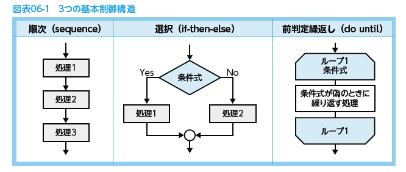
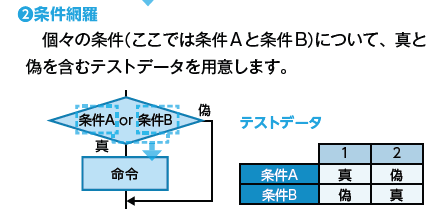
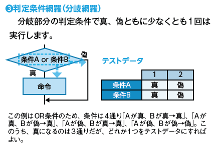
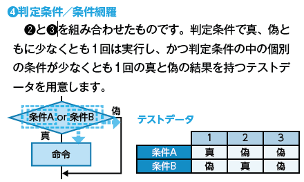
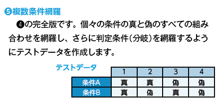
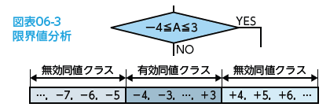
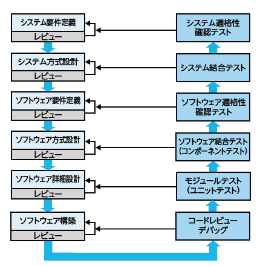
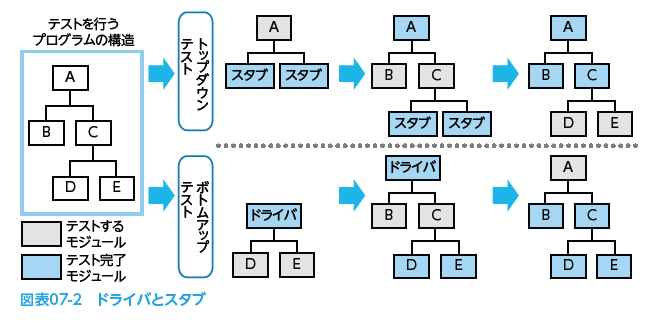
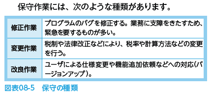

# 2022.06.28.ComputerScience
# システム開発技術②
## コーディングとモジュールテスト
### プログラムの作成(コーディング)
ソフトウェアの作成作業を**コーディング**という。

- どんなことをする？
  - モジュール仕様書などを参考に、**アルゴリズム(処理手順)**を考える。
  - 処理手順
    - モジュールに入力される内容と、処理後に作成されなければならないデータの内容を分析する
    - そのモジュールにはどんな処理か集計すること。

- コーディング基準
  - コーディングするときは次のようにコーディング基準を定める。
  - 例:
    - 字下げ(インデント)を取り入れ、構造をみやすくする。
    - ネスト構造のコードは、分かりやすく記述する。
    - コメントを記述して、第三者に分かりやすくする。
    - 命名規則を定め、プログラムの統一化を図る。
    - 使用禁止命令を、明確に定める。

- テストデータジェネレータ
  - 条件を設定することにより、テストデータを自動的に作成してくれるソフト

- テストカバレッジ分析
  - プログラムの命令や条件がくまなくテストされているか、そのカバレッジ(網羅率)を測定し、分析する方法
  - テストそのものの品質を確認できる

- ソースコードとオブジェクトプログラム
  - プログラム言語を用いて記述した元のプログラムを**ソースコード**(ソースプログラム、原始プログラム)と言うが、そのままでは実行できない
  - コンパイラやインタプリタを用いて、機械語に翻訳した**オブジェクトプログラム**(目的プログラム)ができて、初めて実行可能になる

### プログラムのデバッグ
- デバッグ
  - コーディングしたプログラムモジュールからエラー(**バグ**)を取り除き、正しく動作することを確認する作業

- プログラム言語のルールに則していない**文法エラー**
  - コンパイラ等にかけて発見する
  - これを修正しないとソフトウェアとして完成しないので、すぐ気付く。

**構文解析**

- 処理のアルゴリズムの誤りでおこる**実行(論理)エラー**
  - テストデータと出力をチェックして見つける
  - 明確にエラーが発生するものではないので、気付きにくい。

#### どうやって発見するか？テストデータと出力をチェックして見つける。
- コードレビュー
  - コーディングしたプログラムを第三者とチェックする作業
  - コーディング基準に沿っているか、詳細設計書に基づいているか？などをチェックする

- アサーションチェック
  - プログラム中にそのプログラムが満たすべき条件を記述する。
  - もし満たされないときは、メッセージ出力することでエラーを発見する

- デバッガ(デバッグツール)
  - デバッグを容易に行うためのツール群
  - トレーサや、デバッグショットダンプなどがある

### テストケースの設計
コーディングしたプログラムのテストを設計する。
- どうして設計が必要なの？
  - テストデータがテスト目的にあってないと、テストした時間が無駄になるから
  - かつ、テストで見つけ出したい不具合の検出ができないまま終了してしまう
    - -> これはテストの品質が悪いと言える。

#### ホワイトボックステスト
  - **プログラムの内部の処理や論理に着目**してテストデータを設計する。
  - プログラムの単体テスト(ユニットテスト)、結合テストで利用。

#### ブラックボックステスト
**プログラムの内部構造は意識せず、インターフェースだけに着目**して設計する。
結合テスト以降で利用。

- 同値分析法
  - 入力データの範囲を同値クラスに分割し、各クラスの代表値をテストデータとする手法
  - 有効同値クラス
    - 正当な範囲のクラスデータ
  - 無効同値クラス
    - 不当な範囲のクラスデータ

- 限界値分析法
  - データの境目部分を重点的にチェックする

- 原因結果グラフ法

- エラー埋込法

## 結合テストと適格性確認テスト
- テスト
  - 作成したシステムが設計書どおりに作成されているかどうかを検証する工程

- 段階的詳細化
  - システム要件定義 ~ ソフトウェア構築までの設計工程で、大まかな所から次第に詳細な部分へと設計していく

- 段階的統合化
  - コードレビュー/デバッグ ~ システム適格性確認テストまでのテスト工程では、逆に細かいプログラムから大きなプログラムへと検証していく

### ソフトウェア結合テストの方法
モジュール間のインターフェースを確認する結合テストでは、モジュール完成にずれが生じる。

- 増加テスト
  - テスト済みのモジュールにモジュールを順次結合させながら行うテスト
  - エラーの原因特定が容易であることから、大規模なプログラムのテストに適している

- トップダウンテスト
  - 上位モジュールから、先にテストを済ませていく
  - 下位モジュールは未テストだったりするので、その場合は**スタブ**と呼ばれる仮のモジュールをくっつけてインターフェースの確認を行う

- ボトムアップテスト
  - 下位モジュールからテストを行う
  - 上位が未テストの場合、ドライバと呼ばれる仮のモジュールをくっつけてインターフェースの確認を行う

- 折衷(サンドイッチ)テスト
  - 最上位に近いモジュールはトップダウンテスト、最下位に近いモジュールはボトムアップテストで行う
  - 時系列的に同時に行う

- 非増加テスト
  - 構成する全モジュールを一度に結合してテストする方法
  - 小規模なプロジェクトに向いている
  - 代表例:
    - ビッグバンテスト
      - モジュールごとにドライバまたはスタブを用意して個別にテストし、

### 適格性確認テストの方法
システム結合テストの後に行われるテスト
テストの性質的には**ブラックボックステスト**となる。

- 機能テスト
  - 仕様書に基づいて、**利用者側の要求を機能面で満たしているかを評価**する

- 性能テスト
  - データの処理速度、画面からのリクエストに対する応答時間など、**システム全体の性能を評価**する

- 操作性テスト
  - **ヒューマンインターフェースが使いやすいか、操作ミスや入力ミスを起こしやすくないかなどを評価**する

- 負荷テスト
  - 量的な負荷(データ量、同時発生するリクエストの数など)を与えて、**システムの限界を評価**する

- 例外処理テスト
  - イレギュラーなデータの処理やエラー処理について、**適切に(安全な方向に)動作するかを評価**する

- 障害回復テスト
  - 障害が発生した際に、発生状況を把握でき、原因を突き止められ、適格な復旧作業の手順があり、**迅速に回復できるかを評価**する

- セキュリティテスト
  - ネットワークやデータベース、人が介在する部分などを含めたセキュリティを保持する観点からのテスト。必要に応じた様々なテストを行う

### テスト結果の評価
- **回帰テスト**
  - **リグレッションテスト**
  - 変更した機能と従来からの機能を含めてテストすることで、他の正常な部分に影響を与えていないかを検証する方法
  - **退行テスト**ともいう

## システムの受け入れ・保守
### システムの導入作業
開発したソフトウェアのほかに、システムの稼働に必要なすべての要素を切り替える移行を行う。
サーバや周辺機器、ハードウェア、ネットワーク環境、操作手順や業務プロセスなど

### システムの受入れ支援
- **受入れテスト(承認テスト)**
  - システム結合テストのあと、利用者側(クライアント)にシステムの引き渡しが行われる。
  - この時、受け入れてよいのかどうかを判断するために、行われるテスト
    - 受入れ可否の判断は利用者側の責任(クライアント側)
      - クライアントは、開発者側の支援を受けながら、受け入れ基準やテストデータを準備して実施する

### システムの保守
- 保守とは
  - **運用テストを終了して本番稼働した後に**、システムに潜むバグの発見や性能の低下、利用者によるシステム改善や機能拡張の要求などがあったときに、**システムを修正する作業**
  - システムのライフサイクルにかかる全費用の60~70%が保守費用に当てられると言われるほど、この工程の作業は重要なものである。

#### 保守の作業内容

