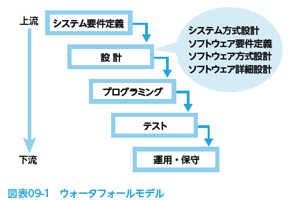
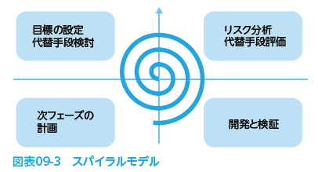
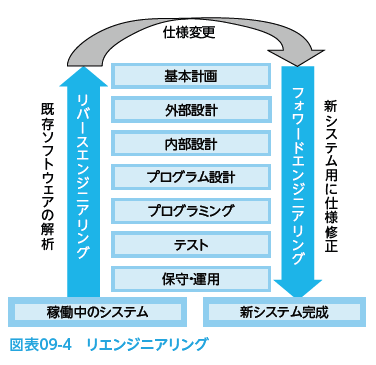
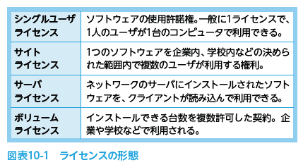

# 2022.07.05.ComputerScience
# ソフトウェアの開発手法
## ソフトウェアの開発モデル
ソフトウェアやシステムを作成する場合に、どんな順序でどのような作業を行うのか、まずモデルケースを選択するところから始める。
- 開発モデル
  - これまでの経験によって、このような内容・順序で構築していくとうまくできるといういくつかのモデルがあり、これらを**開発モデル**という。

### ウォータフォールモデル

- 欠点
  - 水の流れと同じように、作業の後戻りをしないのが原則である。

- 特徴
  - 比較的大きなプロジェクトに向いているモデル
  - 進捗管理や工数管理がしやすい
  - 発進した後の段階での仕様変更に弱く、誤りの発見が遅れやすい
  - 誤りの原因が上流工程であるほど、修正に時間と費用がかかる

### プロトタイピングモデル
開発の早い(最初の)段階で作成した試作品(**プロトタイプ**)を使い、ユーザの確認を得ながら開発を進める手法
**使い捨て型**と**拡張型**(試作品を肉付けして本来のシステムを完成させる)の2つのタイプがある。

- 欠点
  - (依頼人などとの)スケジュール調整が難しい

- 特徴
  - 試作品をユーザが確認することで、仕様の誤解や食い違いを早期に発見でき、それによって手戻り作業の発生を防止できる
  - 埋もれていたニーズや技術者が気付かない点が発掘され、システム品質が向上する

### スパイラルモデル
大規模な開発をするとき、独立性の高い部分ごとに、設計・プログラミング・テストの工程を比較的短期間で繰り返しながら完成度を高めていく手法
作成の様子が「らせん」の形で表現できることから、**スパイラルモデル**と呼ばれる。

- 特徴
  - 開発単位が小規模で独立しているので、開発済みの部分を他の部分に再利用できる
  - 短期間で開発工程を繰り返すので、使用変更や再設計に対応しやすい
  - ウォータフォールモデルを部分敵に踏襲しているので、工程管理が比較的容易
    - 必要に応じてプロトタイピングも取り入れられる
  - 機能ごとに順次作成していくので、開発コストを見積もりやすい
    - また、必要な人員数を抑えることができる

### インクリメンタルモデル(段階的モデル)
- インクリメンタル
  - 段階的に、増加 などを意味する
一連のシステム開発工程を繰り返しながら、システムを徐々に拡張していく開発手法
成長モデルとも言う。

- 欠点
  - スケジュールの見積もりが困難

- 特徴
  - 問題点の早期発見により品質が向上する
    - 開発工程は、要求定義 -> 設計 -> プログラミング -> 評価 を１回の繰り返しとし、評価の結果を次の繰り返しに反映させる。

### アジャイル
スパイラルモデルに似た開発モデル
**短期間**(数週間の単位)で「要求、計画、開発、テスト、評価、リリース」を**繰り返していく**方法で、開発期間の短縮を図る
- 具体的に
  - 利用者側と開発者側が少人数のチームを組み、密接にコミュニケーションをとりながら進めていく
  - これにより仕様の変化に対し、柔軟な対応が可能

### XP(エクストリームプログラミング)
利用者側と開発者側が共有すべき価値が示され、実線すべき**プラクティス**に基づき作業を進めていく。
- ペアプログラミング
- リファクタリング
- テスト駆動開発(TDD)
  - 先にテストケースを作成してから、プログラム(ソースコード)を書く手法
  - テストを効率的に行える。

## ソフトウェアの再利用
既存のソフトウェアを再利用することで、ソフトウェアの生産性と品質を高める
ライブラリやパッケージ

### 部品化による再利用
- 部品化
  - ソフトウェアを構造的にとらえ、その構成要素を部品として**標準化**しておくこと
    - 新システムの構築時には、それらの部品を組み立てることで、高品質なシステムを短期間で完成させることが出来る。

### ソフトウェアパッケージのカスタマイズ
- ソフトウェアパッケージ
  - 多くの企業で運用が可能な、汎用的な業務処理を製品化したソフトウェアで、**業務パッケージ**とも呼ばれる
  - 業務システムを個別に開発するよりも低コストで実現できるが、業務プロセスは企業ごとに異なるため、実際の導入にはソフトウェアパッケージの**カスタマイズ**が必要となる。
    - また、逆に業務そのものをパッケージに合わせて変更する方法もとられる

## リ(再び)エンジニアリング
- システム開発の生産効率を上げるには
  - すでに完成し、稼働しているして生むやソフトウェアを利用して新しいシステムやソフトウェアを作成する
  - これを**リエンジニアリング**という

### リバースエンジニアリング
- リバースエンジニアリング
  - 既存ソフトウェアからシステム仕様を導く方法
  - 再利用開発を支援するだけでなく、既存ソフトウェアの機能の修正や追加などの保守作業にも役立てることができる
    - その際、もとになるソフトウェアの権利者に許可なく開発や販売を行うと、知的財産権を侵害する恐れがある
    - また、ソフトウェアのライセンス契約によってはリバースエンジニアリングを禁止している場合もある

- 仕様をもとに作り出す方法
  - フォワードエンジニアリング

- 既存ソフトウェアの解析
  - リバースエンジニアリング
- 新システム用に仕様修正
  - フォワードエンジニアリング

#### DevOps
[開発を意味する Development と運用を意味する Operations を組み合わせた造語で、開発担当チームと運用担当チームが緊密に協力・連携し、自動化ツールなどを活用して柔軟かつスピーディに開発進めるソフトウェア開発手法。](https://www.itpassportsiken.com/word/DevOps.html)

開発と運用をまとめて意味する造語
開発担当チームと運用担当チームが緊密に協力・連携して開発を進めるソフトウェア開発手法

- 特徴
  - 開発効率の向上
  - 迅速なリリース
  - 信頼性の向上
  - 共同作業による文化の醸成
    - などが期待できる。

# システム開発に伴うさまざまな管理
## 知的財産適用管理
- 知的財産権
  - 著作権や特許権などのこと
開発したソフトウェアを社内のシステムとして適切に管理するには、**知的財産権**を把握し、きちんと管理しておく必要がある。

### ソフトウェアの著作権管理
#### 自社で開発したソフトウェア
- ソフトウェアの著作権者
  - 作成者
    - ただし、その企業の従業員が業務として作成し、法人の名義で公表されたソフトウェアは、原則としてその法人(企業)が著作権を持つことになる。
    - なお、派遣契約の場合も派遣先の法人などが著作者となる。

#### 外部(請負業者)へ委託して開発したソフトウェア
- ソフトウェアの著作権
  - ソフトウェアの作成を委託された側(請負業者)
  - 委託先企業との間で、「開発されたソフトウェアに関わる一切の権利およびソフトウェアの所有権は、委託料を完済された時点をもって移転する」という旨の契約を取り交わしておくのが一般的である。

#### パッケージソフトの改変
ソフトウェアの著作者に無断で改造することは、著作権の侵害になる。
ただし、**パッケージソフトのカスタマイズ**や、**マクロの作成**などについては、正規のユーザが自らそのソフトウェアを使用するための行為として必要と認められる限度においては許容される。

### ライセンス管理
自社が権利を持たないソフトウェアを使用する場合には、**ライセンス契約**を交わす必要があり、獲得したライセンスは契約の範囲で使用するよう適切に管理する必要がある。
また、共同開発を行った場合やそれぞれが保有している著作権を互いに利用し合う場合には**クロスライセンス契約**を交わすことで、効率の良い利用が出来る。

#### ライセンス契約(**使用許諾契約**)

