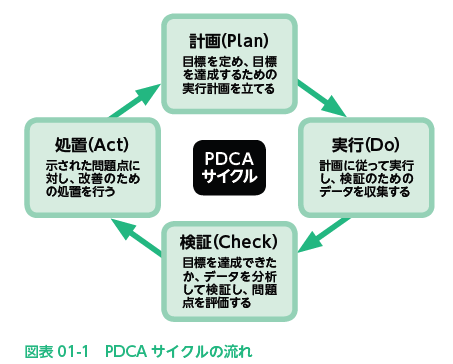

# 2022.07.12.ComputerScience
# プロジェクトマネジメントの全体像
- プロジェクトマネジメント
  - ITシステムの開発やソフトウェア開発などのプロジェクトを総合的に管理していくこと

## プロジェクトとは？
- **プロジェクト**
  - 特定の目的を達成するために組織・実施される活動のこと
  - プロジェクトの目的を達成した時点で活動は終了となる

- **マトリックス組織**
  - 複数部署に同時に所属する組織形態

### プロジェクトの**PDCAサイクル**
1. 計画 Plan
   1. 目標を定め、目標を達成するための実行計画を立てる
2. 実効 Do
   1. 計画に従って実行し、検証のためのデータを収集する
3. 検証 Check
   1. 目標を達成できたか、データを分析して検証し、問題点を評価する
4. 処理 Act
   1. 示された問題点に対し、改善のための処置を行う

- **ISO 21500**
  - プロジェクトマネジメントの国際標準として2012年に発行された
    - 国際標準のPMBOK(ピンボック)をもとにした体系になっている
> PMBOKの策定者である米国プロジェクトマネジメント協会も策定の参画しているため、用語などに多少の違いはあるが、ISO21500とPMBOKは相互に共通する内容となっている

- プロジェクトの特性
  - 独自性も有期性もある
  - プロジェクトは、それぞれ独自の目的を持って立ち上げられ(独自性がある)、目標達成によって活動は終了する(有期性がある)

- 独自性
  - 他にはない特徴や内容を持つこと
- 有期性
  - 期間が限られていること

## プロジェクトマネジメントのお手本となる「PMBOKガイド」
- PMBOK
  - Project Management Body of Knowledge

[1対1で情報の伝達を行う必要があるプロジェクトチームにおいて，メンバが6人から10人に増えた場合，情報の伝達を行うために必要な経路の数は何倍になるか。](https://www.itpassportsiken.com/bunya.php?m=10&s=1&no=31)

₆C₂ = 15, ₁₀C₂ = 45, 15 : 45 = 1 : 3

- デファクトスタンダード
