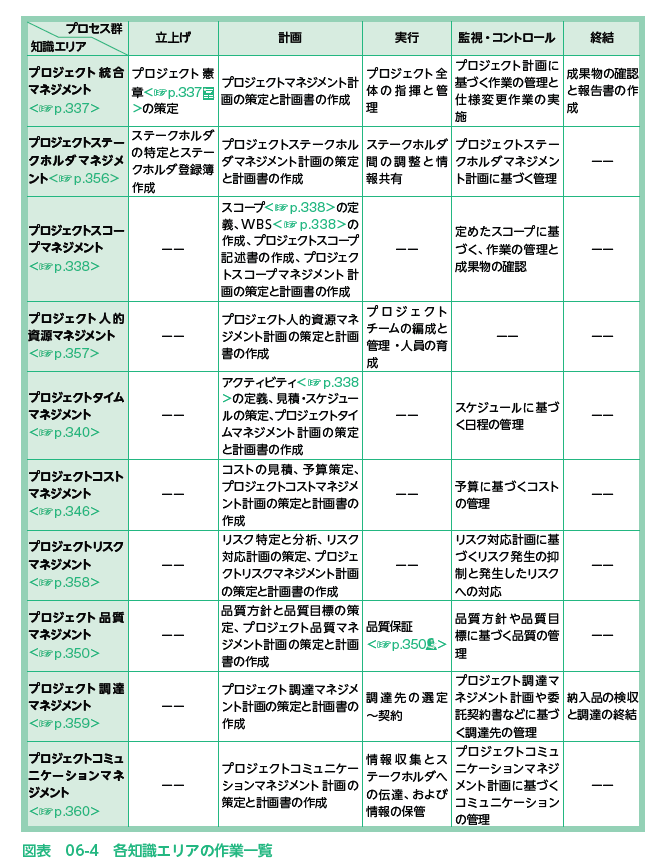
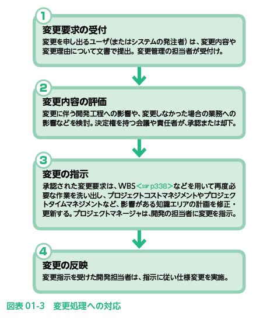
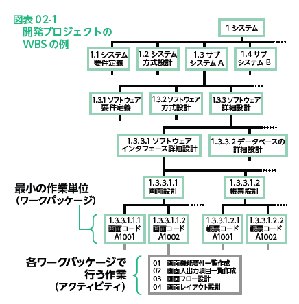

# 2022.07.12.ComputerScience
# プロジェクトマネジメントの全体像
- プロジェクトマネジメント
  - ITシステムの開発やソフトウェア開発などのプロジェクトを総合的に管理していくこと

## プロジェクトとは？
- **プロジェクト**
  - 特定の目的を達成するために組織・実施される活動のこと
  - プロジェクトの目的を達成した時点で活動は終了となる

- **マトリックス組織**
  - 複数部署に同時に所属する組織形態

### プロジェクトの**PDCAサイクル**
1. 計画 Plan
   1. 目標を定め、目標を達成するための実行計画を立てる
2. 実効 Do
   1. 計画に従って実行し、検証のためのデータを収集する
3. 検証 Check
   1. 目標を達成できたか、データを分析して検証し、問題点を評価する
4. 処理 Act
   1. 示された問題点に対し、改善のための処置を行う

- **ISO 21500**
  - プロジェクトマネジメントの国際標準として2012年に発行された
    - 国際標準のPMBOK(ピンボック)をもとにした体系になっている
> PMBOKの策定者である米国プロジェクトマネジメント協会も策定の参画しているため、用語などに多少の違いはあるが、ISO21500とPMBOKは相互に共通する内容となっている

- プロジェクトの特性
  - 独自性も有期性もある
  - プロジェクトは、それぞれ独自の目的を持って立ち上げられ(独自性がある)、目標達成によって活動は終了する(有期性がある)

- 独自性
  - 他にはない特徴や内容を持つこと
- 有期性
  - 期間が限られていること

## プロジェクトマネジメントのお手本となる「PMBOKガイド」
- PMBOK
  - Project Management Body of Knowledge

- PMBOKガイド
  - 米国プロジェクトマネジメント協会(PMI)が、プロジェクトマネジメント業務の標準化を目的として1987年に発刊し、2012年に最新の第5版が発刊される
  - 国際規格ではないが、プロジェクトマネジメントのデファクトスタンダード(事実上の標準)である

[1対1で情報の伝達を行う必要があるプロジェクトチームにおいて，メンバが6人から10人に増えた場合，情報の伝達を行うために必要な経路の数は何倍になるか。](https://www.itpassportsiken.com/bunya.php?m=10&s=1&no=31)

₆C₂ = 15, ₁₀C₂ = 45, 15 : 45 = 1 : 3

## プロジェクトマネジメントの10項目

| 知識エリア           | 立ち上げ         | 計画           | 実地        | 監視・コントロール      | 終結            |
| --------------- | ------------ | ------------ | --------- | -------------- | ------------- |
| 統合マネジメント        | プロジェクト憲章の策定     | 計画の策定と計画書の作成 | PJ全体の式と管理 | 作業管理と仕様変更作業の実施 | 成果物の確認と報告書の作成 |
| ステークホルダマネジメント   | 特定と登録簿の作成 | 計画の策定と計画書の作成      | 調整と情報共有          | 計画に基づく管理               | --              |
| スコープマネジメント      | --             | 定義、WBS,記述所の作成、計画の策定と計画書の作成             | --          | 作業の管理と成果物の確認               | --              |
| 人的資源マネジメント      | --             | 計画の策定と計画書の作成             | チームの編成と管理・人員の育成          | --               | --              |
| タイムマネジメント       | --             | アクティビティの定義、見積・スケジュールの策定、計画の策定と計画書の作成             | --          | 日程の管理               | --              |
| コストマネジメント       | --             | コストの見積、予算策定、計画の策定と計画書の作成             | --          | コストの管理               | --              |
| リスクマネジメント       | --             | リスク特定と分析、リスク対応計画の策定、計画の策定と計画書の作成             | --          | リスク発生の抑制と発生したリスクへの対応               | --              |
| 品質マネジメント        | --             | 品質方針と品質目標の策定、計画の策定と計画書の作成             | 品質保証          | 品質方針や品質目標に基づく品質の管理               | --              |
| 調達マネジメント        | --             | 計画の策定と計画書の作成             | 調達先の選定～契約          | 計画や委託契約書などに基づく調達先の管理               | 納入品の検収と調達の終結              |
| コミュニケーションマネジメント | --             | 計画の策定と計画書の作成             | 情報収集とステークホルダへの伝達、情報の保管          | 計画に基づくコミュニケーションの管理               | --              |

### プロジェクト統合マネジメント
プロジェクト全体の統括的な管理・調整を行う
複数の知識エリアをまたがるときは、プロジェクト統合マネジメント！

- **プロジェクト憲章**とは
  - **プロジェクトの目標や成果物、プロジェクトで行うべき範囲、プロジェクトのルールなどを定めた文書**のこと

- **プロジェクトマネージャ**とは
  - プロジェクトの**納期・予算・成果物の品質について管理を行う責任者**であると共に、プロジェクトメンバーを指導する立場にもある。

### プロジェクトステークホルダマネジメント
- ステークホルダとは？
  - 利害関係者のこと
  - 開発プロジェクトでは、システムの発注者(スポンサ)、システムのユーザ、プロジェクトマネージャ、プロジェクトのメンバなどがステークホルダにあたる
  - システム開発を外部に依頼する場合は、**委託先もステークホルダ**になる。

### プロジェクトスコープマネジメント
- スコープとは？
  - 範囲
    - どんな項目をどこまでやるのかをきちんと明確にしておくことが大事
  - PMBOKガイドでは
    - プロジェクトの**活動範囲**と、**達成すべき成果物の仕様**をまとめて**スコープ**と呼ぶ
プロジェクトスコープマネジメントは、スコープを定義し、プロジェクト遂行に必要な作業を**過不足なく洗い出していく**活動で、定義したスコープは**プロジェクトスコープ記述書**に記載する。

#### 分割して作業を洗い出すWBS
Work Breakdown Structure
プロジェクトの遂行に必要になる**すべての作業項目を、大まかな分類から細かな分類へと階層的に順次分割していくことで明らかにする手法**

- ワークパッケージ
  - WBSを用いて作業を分解したときに**最下層となる作業管理の最小単位**のこと

- アクティビティ
  - **ワークパッケージに含まれる作業項目**のこと

## 人月、人日、人時
作業を表す単位のこと

### 例
- 1人**月**
  - 1人が**1か月働いた作業量**を1とした単位
- 1人**日**
  - 1人が**1日働いた作業量**を1とした単位
  - 1人**時**
  - 1人が**1時間働いた作業量**を1とした単位

***
# VBA
'**********************************
' Main：並べ替え処理
' https://www.itpassportsiken.com/bunya.php?m=14&s=2&no=18
'**********************************
Sub 基本交換()
    Dim left As Integer
    Dim right As Integer

    left = Range("C6").Value
    right = Range("D6").Value

    Range("C6").Activate

    ' Offset(y, x) -を指定することも出来る。
    ActiveCell.Offset(0, 0).Select

    If left > right Then
        '結果が真の時に行うスコープ
        Call 入れ替え(left, right)

        If Range("D6").Value > Range("E6").Value Then
        '結果が真の時に行うスコープ
            Call 入れ替え2(Range("D6").Value, Range("E6").Value)

            If Range("E6").Value > Range("F6").Value Then
        '結果が真の時に行うスコープ
                Call 入れ替え3(Range("E6").Value, Range("F6").Value)

                If Range("F6").Value > Range("G6").Value Then
        '結果が真の時に行うスコープ
                    Call 入れ替え4(Range("F6").Value, Range("G6").Value)

                End If

            End If
        End If
    End If
End Sub

'**********************************
' サブ：基本交換法
' https://www.itpassportsiken.com/bunya.php?m=14&s=2&no=13
'**********************************
Sub 入れ替え(a As Integer, b As Integer)
    Dim test As Integer

    test = a
    Range("C6").Value = b
    Range("D6").Value = test

End Sub

Sub 入れ替え2(a As Integer, b As Integer)

    Dim test As Integer

    test = a
    Range("D6").Value = b
    Range("E6").Value = test

End Sub

Sub 入れ替え3(a As Integer, b As Integer)

    Dim test As Integer

    test = a
    Range("E6").Value = b
    Range("F6").Value = test

End Sub

Sub 入れ替え4(a As Integer, b As Integer)

    Dim test As Integer

    test = a
    Range("F6").Value = b
    Range("G6").Value = test

End Sub
