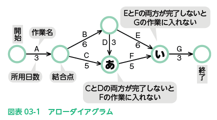
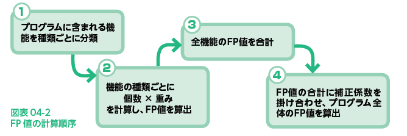

# 2022.07.19.ComputerScience
# プロジェクトタイムマネジメント
## 目標管理のためのマネジメント
- プロジェクトタイムマネジメント
  - 期間内にプロジェクトを完了させるためのコントロールを行う管理活動

1. **アクティビティリスト**の作成
   - **アクティビティはスコープマネジメントにて、WBSで洗い出される**
2. アクティビティの作業順序を決める
3. 各アクティビティに必要な作業期間を見積もる
4. プロジェクト全体の日程計画の策定(階層化)
   1. **大日程計画表(マスタースケジュール)**
   2. **中日程計画表(工程別作業計画)**
   3. **小日程計画表(週間作業計画)**

## スケジュールの作成手法
### PERT(パート)
- Program Evaluation and Review Technique
  - アクティビティ日数(時間)と、それぞれの関連が一覧でき、全体の日数を知ることが出来る
  - 作業の順序を矢印で表した**アローダイヤグラム**を使い、どの作業が終わってからどの作業に取り掛かるのかを整理する

- **アローダイヤグラムが選ばれる理由**
  - 複数のアクティビティが交差しているプロジェクトでは、すべてのアクティビティが同時並行して進行出来ないケースがある
    - 例: 前のアクティビティが終わらないと、開始できないアクティビティがある
  - **アローダイヤグラムなら「どの作業が終わってから、どの作業に取り掛かるか」を四角的に一覧化することができるため、活用しやすいため**

- **クリティカルパス**
  - 最も所要日数がかかる経路
**全体の所要日数を短縮したい場合は、クリティカルパス上の作業を短縮**することを考える

- **ダミー作業**
  - 実際に作業時間は発生しない経路の線(0日/時間)
    - 結合点を結ぶため、便宜上、破線の矢印で記される
  - ※ダミー作業の経路がクリティカルパスのケースの場合もあるため、注意が必要

- **最早結合点時刻**
  - **その結合点以降の作業を最も早く始められる時刻**を表す
  - 数値の大きい方が最早結合点時刻となる

- **最遅結合点時刻**
  - **最も遅く始めても間に合う時刻**を表す
  - 数値の小さい方が最遅結合点時刻となる

# プロジェクトコストマネジメント
## コストマネジメントの活動内容
- **プロジェクトコストマネジメント**
  - 定められた予算内でプロジェクトを完了させることを目的とした活動
  - どんな活動？
    - プロジェクトの初期段階で行うプロジェクト活動に必要なコストの見積もり
    - プロジェクト活動中のコスト管理

- **工数**とは
  - 人件費の計算の基になるもの
    - どれだけ正確に見積もれるかが、開発プロジェクトのコスト管理の鍵を握る
  - 工数を表す単位として**人日**や**人月**を用いる
    - 人日
      - ひとりの担当者がその作業を終えるのに何日必要か
    - 人月
      - ひとりの担当者が完了するのに何か月必要か

## コストの見積手法
代表的な見積手法は以下の4つ

### 類推見積法
過去に行った**類似するシステムの開発をもとに、新システムとの相違点**などを分析して、必要な工数とコストを見積もる手法

### 標準タスク法
(WBSの最小単位である)**ワークパッケージ**や、(さらに小さく作業を分割した)**アクティビティ**のひとつひとつから工数とコストを予測
それらを積み上げて合計していくことで、新システム全体にかかる工数やコストを見積もる手法

### プログラムステップ(LOC)法
新システムで開発するそれぞれのプログラムの、完成時の**ステップ数**を予測
すべてのプログラムの総ステップ数から工数やコストを見積もる手法
LOC(Lines Of Code)法とも呼ばれる。

- ステップ数
  - 作成するプログラムのソースコードの行数を指す
  - プログラムが長くなるほど、またシステムに含まれるプログラムの数が多いほど、設計やコーディング(プログラミング)には時間がかかる
  - 工数やコスト計算の目安として用いられる

### ファンクションポイント(FP)法
- ファンクション
  - 機能のこと

プログラムに含まれる機能の数や、その機能の複雑度などから工数やコストを見積もる手法
機能に注目するため、非エンジニアにも分かりやすく、ユーザ自身が見積もることも可能

### FP法の計算問題

1. 機能ごとに分類
- FP法の5つ分類
  - 内部論理ファイル
    - プログラムが扱うデータや制御情報のまとまりのこと
  - 外部インターフェースファイル
    - 他のプログラムやユーザから入力されたデータや制御情報のまとまりのこと
  - 外部入力
    - 外部インターフェースを受け取り、これによって内部論理ファイルの作成・更新・削除などを行う機能
  - 外部出力
    - プログラムが内部論理ファイルを作成・更新・削除などを行い、ほかのプログラムや装置になどに出力する機能
  - 外部紹介
    - 外部インターフェースファイルを参照する機能
    - ※参照した情報を単に画面に出力したり、他のプログラムへ渡すための機能で、内部論理ファイルの書き換えは行わない

2. 機能の種類ごとに、異なる複雑さの「重み」としてあらわし、機能の個数と掛け合わせることで、FP値を計算する

3. 全機能のFP値を合計

4. FP値の合計に補正係数を掛け合わせ、プログラム全体のFP値を算出

# プロジェクト品質マネジメント
プロジェクトとして達成すべき**成果物の品質の目標策定と、品質の評価・コントロール**を行う

## 品質管理上、重要視される活動
### レビュー
成果物の検証や再検討を行うことを**レビュー**という
複数のメンバーが参加し、成果物の説明、問題点の指摘、改善策の検討などを行う

### テスト
設計内容や作成されたプログラムが、定められた仕様と一致しているかを検証する作業
柵下プログラムが仕様どおりに動作するか、要求されている性能を満たしているかを、漏れなく計画的に検証していく
