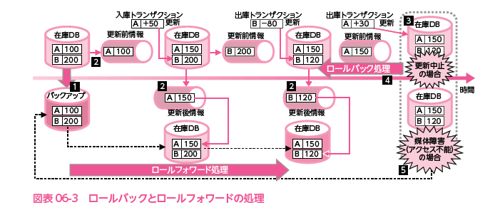

# 2022.08.30.ComputerScience_b
## ESSIDとは(テストの誤回答部分)
無線LANアクセスポイントに付ける識別子(名前)のこと

- なぜ名前を付ける必要がある？
1つのアクセスポイントから通信を送った際に、どのアクセスポイントがその通信を処理したらいいのかという問題が起こる。
つまり、「混信状態」が発生する。
これを防ぐ為に1つ1つのアクセスポイントにESSIDと呼ばれる識別子(名前)を付ける。

## サービスマネジメント午後問
#### 設問2

- 2018年度予算
  - 人件費 3000
  - PC費 640
  - ネットワーク費 260

**割合で比較する**

#### 設問3
- 利益率
  - (提示価格 - 予算) / 提示価格

また，作業の一部を自動化することによって，人件費を先の5%と合わせて15%削減できることが分かった。ただし，この場合には，サーバ費については5%上がる見込みである。運用サービス部では，先のその他経費の10%削減と合わせてB社サービスの2018年度の予算を再度作成した。このとき，提示価格を要求価格と同額にすると，利益率はf%になる。ここで，%表示する値は，利益率に100を乗じて小数第2位で四捨五入したものである。

1. 人件費15%down -> 450
2. サーバ費5%up -> 65
3. その他10%down -> 110
予算 6300 + 65 - 560 -> 5805
要求価格 -> 7000 * 0.9 -> 6300
(6300 - 5805) / 6300 -> 0.0785(7.9%)

# サービスマネジメント
**ITサービスを効率的に運用する仕組みのこと**
- ITサービスとは？
  - 情報システムの利用に伴う利用者のサポートや、システムの維持管理などのこと

サービスマネジメントを実施する際のガイドラインとなるのが、**ITIL**や**ISO/IEC 20000**です。

## ITサービスの実践方法を示すITIL
- ITIL
  - Information Tchnology Infrastructure Library
  - ITサービスの管理・運用に関するガイドライン
  - ITサービスを運用管理するためのベストプラクティスを集め、ITサービスのフレームワークを示したライブラリのこと

## 提供するサービスを明確にするSLA
- SLA
  - Servis Level Agreement: **サービスレベル合意書**
  - サービスの範囲と品質を明確にした合意書
  - プロバイダ(サービス提供者)と顧客(サービス委託者)の間で交わされる

- SLAには以下の内容を数値によって定量的に明示する
  - サービス時間
  - 可用性・信頼性の目標値
  - 応答時間

## サービスの設計・移行
- **サービス設計書**
  - ユーザのニーズを満たし、SLAをクリアするための検討
  - どんなことを検討する？
    - サービスに用いるシステム技術
    - 必要な人材・機材
    - 新サービスへの移行の計画や運用、引継ぎなど

- **サービス受け入れ基準(SAC)** / 運用サービス基準
新サービスの移行前には受け入れテストを行う。
機能や品質がSACを満たすかどうかを確認する。

- 移行事例
  - 移行には計画が必要
  - 移行計画書には、次の内容の記載が必要
1. 移行作業が失敗した場合に旧システムに戻す際の判断基準
   1. 移行が失敗した場合に、対象業務への影響を避けるために速やかに旧システムへ戻す必要がある
2. 旧システムへの復旧手順

- 移行テストを実施する主要な目的は何か
  - 確実性や効率性の観点で，既存システムから新システムへの切替え手順や切替えに伴う問題点を確認する。

## サービスマネジメントプロセス
**ITサービスを効率的に運用・管理していく活動のこと**

- **サービスデスク**(ヘルプデスク)
  - ITサービスの長期的な計画と、改善に関する一連の活動
  - ユーザがいつでもサービスを受けられるようにするための日常的な運用に関する一連の活動

- **インシデント管理**
  - ITサービスのレベルが低下した場合に、原因追及は後回しにして、迅速に回復するための管理を行う
  - 例えば: PCのリセットボタンを押して再起動することで正常に動作すれば、インシデント管理は完了となる
    - しかし、なんらかの原因があってトラブルが起きるので、その原因を追及して取り除く**問題管理**が必要になるわけである。

#### サービスマネジメントにおける運用の各プロセス
1. **SLM(サービスレベル管理)**
Service Level Management
- SLAの内容を達成し、維持・改善するための活動
- PDCAサイクルを実行して、サービスレベルの維持と向上を図る

2. **サービスの報告**
顧客との合意に基づいて、信頼できる正確な報告書を作成する

3. **サービスの継続および可用性管理**
顧客と合意したサービス継続を、あらゆる状況の下で満たすことを確実に行うための管理

4. サービスの予算業務および会計業務
ITサービスにかかわるコストの予測と実際に発生したコストの計算や課金の管理を行う

5. キャパシティ管理
容量、能力などシステムのキャパシティを管理し、最適なコストで、現在および将来のシステムの安定稼働を実現する

6. 情報セキュリティ管理
情報資産の機密性、完全性、アクセス性を保つため、情報セキュリティ管理策の導入と運用を行う

7. 事業関係管理
サービス提供者と顧客との間に良好な関係を確立するために必要な活動を行う

8. 供給者管理
サービスマネジメント導入及び運用のため、供給者を用いる場合の管理活動を行う

9. インシデントおよびサービス要求管理
顧客と合意したサービスを、可能な限り迅速回復させるための対応を行う
また、サービス要求への対応を実施する

10. 問題管理
問題の根本原因を突き止め、インシデントの再発防止の解決策を提示する

11. 構成管理
ITサービスを構成するハードウェア、ソフトウェア、ドキュメントなどの構成品目に関する情報を定義し、正確な構成情報を維持する

12. 変更管理
すべての変更を制御された方法で、アセスメント、承認、実装、レビューを確実に実施し、リスクの回避、効率的な変更処理の実施などを行う

13. リリースおよび展開管理
変更管理で承認された変更を稼働環境に配送し、配布し、追跡する

- スループットとは？
  - 与えられた時間内に、システムが処理できる仕事量によって処理能力を評価するための指標のこと

- **MTBF**
  - 平均故障間隔
  - システムの**信頼性**をあらわす尺度で利用される
  - 稼働と故障による停止が繰り返されるうちの稼働時間の平均の間隔
  - **値が大きいほど、信頼性が高い**

- **MTTR**
  - 平均修理間隔
  - システムの**保守性**をあらわす尺度で利用される
  - 修理時間の平均値
  - 故障が発生して不稼働になってから、修理が完了して稼働するまでの平均時間
  - **値が小さいほど、保守が容易**

[これだけは覚えて！「RPO」と「RTO」](https://www.networld.co.jp/sp/learn_first/backup/1st/p08_10.html)

## サービスの運用
資源管理や運用計画の策定から、ジョブスケジューリング、運用オペレーション、**バックアップ**、利用者からの問い合わせ窓口となるサービスデスクの提供など

- 運用オペレーション
  - システムを安定的に稼働させるために手順に従い、システムの監視、操作、状況連絡を実施する
1. スケジュール設計
2. 障害時運用設計
   1. データの回復や待機系の切り替えなど、障害時の運用方式に関する設計
3. システムの導入
4. システムの移行
5. 運用支援ツール
   1. 監視ツール
   2. 診断ツール

- サービスデスク(ヘルプデスク)
サービスデスクは、利用者からの問合せに対する窓口機能を提供し、適切な部署への引継ぎ、対応結果の記憶と管理などを行う
(利用者からの問合せに対する窓口の提供)
1. 中央サービスデスク
   1. 全ての利用者に単一の窓口を設ける方式
2. ローカルサービスデスク
   1. 利用者の拠点ごとに窓口を設ける方式
3. バーチャルサービスデスク
   1. いくつかのサービスデスクをネットワークなどで結び、単一の窓口として機能させる方式

## 過去問関連事項
#### データベースのトランザクション処理(教本P188)
- トランザクションとは？
  - データベースに対するひとまとまりの要求単位のこと
  - データベースの仕事単位
大規模なデータベースになると多くのトランザクションが集中し、多大な負荷がかかることで障害が発生することがある。
このような障害発生に対して保管されているデータを保護するため、データベースには**ACID特性**を備えている。(求められる)

1. Atomicity(原子性): アトミシティー(アトミック性)
「全ての処理が完了する」か、「どの処理も行われていない」のどちらかで終了するという性質

2. Consistency(一貫性): コンシステンシー
更新処理などでデータが変更された場合に、構成する複数のデータ間に矛盾が生じないという性質

3. Isolation(分離性): アイソレーション
複数のトランザクションが同時にデータベースをアクセスしても相互に干渉せず、順序づけて実行した場合の結果と一致するという性質

4. Durability(持続性): デュラビリティー
いったん更新(トランザクションが完了)されたデータベースの内容が障害などで消失しないという性質

#### 障害からの回復のための方策

1. バックアップの取得
データベース全体のバックアップを別の記憶媒体にとっておく

2. ログの取得
レコードの更新前後の内容を、**ログファイル**(ジャーナルファイル)に書き込む
更新前の内容 -> 更新前イメージ
更新後の内容 -> 更新後イメージ

3. ロールバック処理
障害が発生したとき、その時点のデータベースの内容と、更新前イメージを使用して、障害発生直前の状態までデータベースを復元する
これを**ロールバック処理**またはバックワードリカバリと呼ぶ。

4. ロールフォワード処理
ロールバック処理で復元できない場合は、最新のバックアップファイルと更新後イメージとを使用して、障害発生直前の状態までデータベースを復元する
これを**ロールフォワード処理**またはフォワードリカバリと呼ぶ

## ファシリティマネジメント
**建物や設備が最適な状態になるように、監視し改善する管理活動のこと**

例:
- 建物に**免震装置**を備える
- 防災防犯設備を整える
- 機器の冷却用の通路(**コールドアイル**)や廃熱用通路(**ホットアイル**)により故障率を下げる
- 停電に備えて**UPS**や**自家発電設備**を備える
- 通信設備を整える
- など

#### UPS(無停電電源装置) / 自家発電設備
停電や瞬断に備えて、内部にバッテリを備えた装置のこと
停電時に10数分程度の電源が供給されるため、システムを安全に停止させるなどが可能
