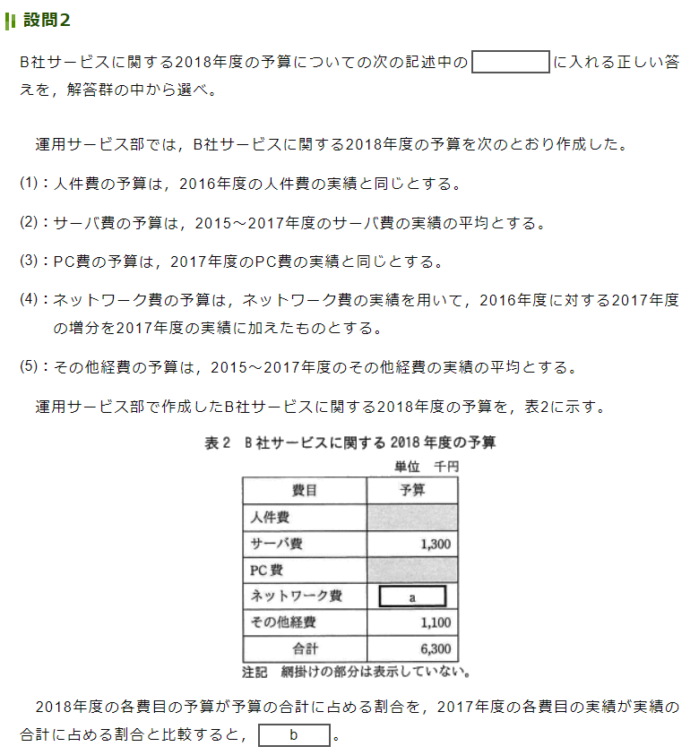
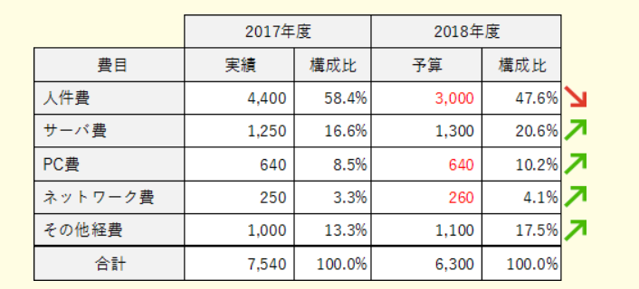

# 2022.08.30.ComputerScience_b
## ESSIDとは
無線LANアクセスポイントに付ける識別子(名前)のこと

- なぜ名前を付ける必要がある？
1つのアクセスポイントから通信を送った際に、どのアクセスポイントがその通信を処理したらいいのかという問題が起こる。
つまり、「混信状態」が発生する。
これを防ぐ為に1つ1つのアクセスポイントにESSIDと呼ばれる識別子(名前)を付ける。

## サービスマネジメント午後問
#### 設問2

- 2018年度予算
  - 人件費 3000
  - PC費 640
  - ネットワーク費 260

**割合で比較する**

#### 設問3
- 利益率
  - (提示価格 - 予算) / 提示価格

また，作業の一部を自動化することによって，人件費を先の5%と合わせて15%削減できることが分かった。ただし，この場合には，サーバ費については5%上がる見込みである。運用サービス部では，先のその他経費の10%削減と合わせてB社サービスの2018年度の予算を再度作成した。このとき，提示価格を要求価格と同額にすると，利益率はf%になる。ここで，%表示する値は，利益率に100を乗じて小数第2位で四捨五入したものである。

1. 人件費15%down -> 450
2. サーバ費5%up -> 65
3. その他10%down -> 110
予算 6300 + 65 - 560 -> 5805
要求価格 -> 7000 * 0.9 -> 6300
(6300 - 5805) / 6300 -> 0.0785(7.9%)

# サービスマネジメント
**ITサービスを効率的に運用する仕組みのこと**
- ITサービスとは？
  - 情報システムの利用に伴う利用者のサポートや、システムの維持管理などのこと

サービスマネジメントを実施する際のガイドラインとなるのが、**ITIL**や**ISO/IEC 20000**です。

## ITサービスの実践方法を示すITIL
- ITIL
  - Information Tchnology Infrastructure Library
  - ITサービスの管理・運用に関するガイドライン
  - ITサービスを運用管理するためのベストプラクティスを集め、ITサービスのフレームワークを示したライブラリのこと

## 提供するサービスを明確にするSLA
- SLA
  - Servis Level Agreement: **サービスレベル合意書**
  - サービスの範囲と品質を明確にした合意書
  - プロバイダ(サービス提供者)と顧客(サービス委託者)の間で交わされる

- SLAには以下の内容を数値によって定量的に明示する
  - サービス時間
  - 可用性・信頼性の目標値
  - 応答時間

## サービスの設計・移行
- **サービス設計書**
  - ユーザのニーズを満たし、SLAをクリアするための検討
  - どんなことを検討する？
    - サービスに用いるシステム技術
    - 必要な人材・機材
    - 新サービスへの移行の計画や運用、引継ぎなど

- **サービス受け入れ基準(SAC)** / 運用サービス基準
新サービスの移行前には受け入れテストを行う。
機能や品質がSACを満たすかどうかを確認する。

- 移行事例
  - 移行には計画が必要
  - 移行計画書には、次の内容の記載が必要
1. 移行作業が失敗した場合に旧システムに戻す際の判断基準
   1. 移行が失敗した場合に、対象業務への影響を避けるために速やかに旧システムへ戻す必要がある
2. 旧システムへの復旧手順

