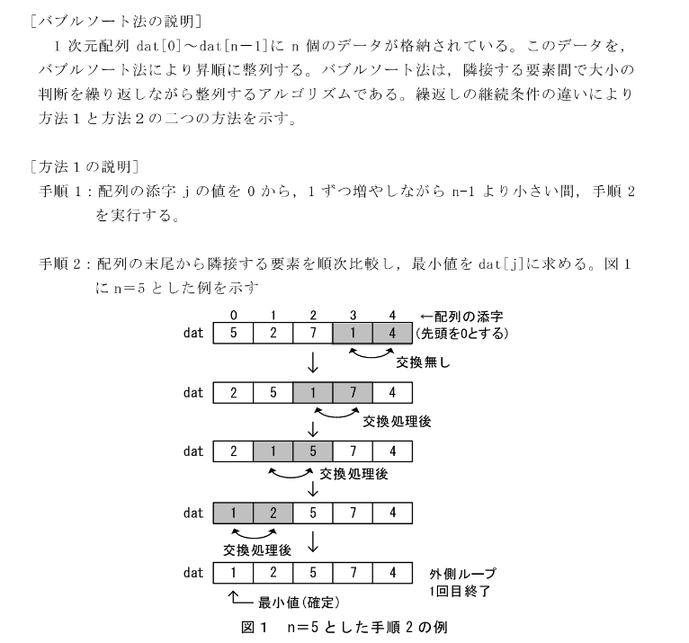
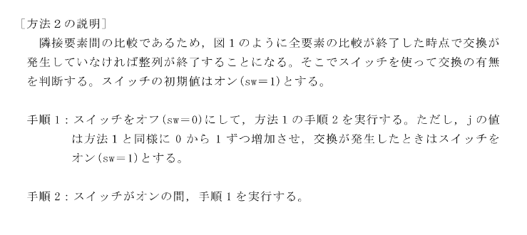
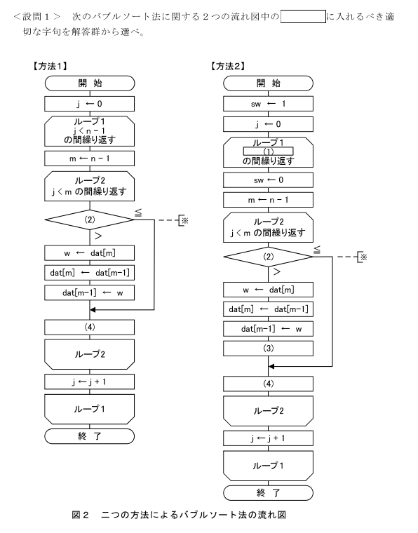

# 2022.09.06.ComputerScience_b
# アルゴリズム

1. dat[0] ~ dat[n-1] にn個のデータが格納されている。
2. バブルソートでこれを昇順に整列させる。

- 方法1
1. 配列のindex[j]の値を0から1ずつ増やしながら`n-1`より小さい間、手順2を実行する
2. 配列の末尾から隣接する要素を順次比較し、最小値をdat[j]に求める。

- 方法2
スイッチの初期値はオン(sw=1)
1. スイッチをオフ(sw=0)にして、方法1の手順2を実行する。
ただし、jの値は方法1と同様に0から1ずつ増加させ、交換が発生したときはスイッチをオン(sw=1)とする。
2. スイッチがオンの間、手順1を実行する。

