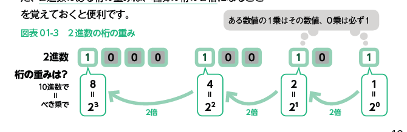

# 2022.09.13.ComputerScience
# コンピュータで扱う「数」の工夫
## コンピュータは「工夫」で動かす
- コンピュータは、電子回路の組み合わせで作られている。
- コンピュータは、プログラムで動作される。

プログラムは一見複雑な命令に見えるが、個々の回路単体は**電流が流れている状態(ON)と、流れていない状態(OFF)**しか持たない単純な装置。

**0と1だけで数を扱うコンピュータ**

- 2進数
- 10進数

https://www.itpassportsiken.com/bunya.php?m=13&s=1&no=9

01011010
01101011
11000101

- 基数
2進数 -> 2
10進数 -> 10
桁上りが起きる「もと」の数

- 桁の重み

11000101
(2,4,8,16,32,64,128,256)
256+128+8+2
= 394

https://www.fe-siken.com/bunya.php?m=1&s=1&no=73

131 - 45 = 53
53 + 45 = 131に変換する
左辺1桁を足し合わせて131の1桁目の1になる可能性を探る
桁上りが7の時に131の1桁目の1になる。
よって7進数。
