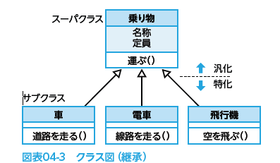

# 2022.06.21.ComputerSystem
# システム開発技術①
## システム開発のプロセス
- **開発プロセス**
  - 企画プロセスや要件定義プロセスで明らかにした**ユーザが必要とする機能**を、具体的なシステムへと展開し、現場へ実装するまでのプロセスのこと

1. システム要件定義でシステムの全体像を掴むことから始める
2. 肯定が進むにつれ、より細部の機能や仕様を決める**段階的詳細化**という手法が使われる。

### 作業手順
↓
企画プロセス
要件定義プロセス
- 開発プロセス
  1. システム要件定義
  2. システム方式設計(外部設計の一部を含む)
- ソフトウェア実装プロセス
  3. ソフトウェア要件定義(外部設計)
  4. ソフトウェア方式設計(内部設計)
  5. ソフトウェア詳細設計(プログラム設計)
  6. ソフトウェア構築(コーディング) + デバッグ
  7.  テスト
  8.  移行
運用プロセス
保守プロセス

### システム要件定義
- システムに対する**ユーザの要求を明確化**するプロセス
- ユーザの要求を整理・分析しながら、表面化していない隠れた要求を掘り起こす作業を行う
  - 工程の最後に、システムへの要件を**要件定義書**にまとめ、システム利用者と開発者が共同で**レビュー**を行い、まとめた結果を確認する。

- レビューとは
  - 複数の関係者によって作成された仕様書やプログラムなどの成果物を検査し、問題点を洗い出す作業
  - 開発の各工程の最終段階(次の工程へ行く前)で行う
  - レビューの種類
    - ウォークスルー
    - インスペクション：モデレータ

### システム方式設計
外部設計とも呼ばれていた
システム要件を、ハード・ソフト・手作業に振り分け、それぞれに必要なシステム構成を決めていく

### ソフトウェア要件定義
- ソフトウェア要件定義
  - 構築するシステムのソフトウェア部分について要件を確率していきます

- 利用される図式手法
  - ヒアリング
    - 聞き取り
  - ユースケース図
  - プロトタイプ
  - DFD
  - E-R図
  - UML
  - 決定表

### ソフトウェア方式設計
※開発者側になってくる
- ソフトウェア方式設計
  - 開発者の観点で、システムを機能単位の**コンポーネント(サブシステム)**に分割し、それらをつなぐコンポーネント間インターフェースの仕様、データベースの最上位レベルの仕様を設計していく。

### ソフトウェア詳細設計
前工程で分割したソフトウェアコンポーネント、およびインターフェースについて、それぞれの詳細内容を設計していく

### ソフトウェア構築
実際にコーディング(プログラミング)を行っていく

↓
テスト・移行

## システム開発に用いる図式手法
システム設計では、**システムの利用者とシステムの開発者が相互に理解を深めるため**、様々な図式手法を用いて**情報を共有する**。

- UML
  - Unified Modeling Language
  - システム開発における業務の流れの分析や、システムに要求される機能、構造を図示できます
  - これらを用いる事で**開発作業の効率化**とともに、開発プロジェクトのメンバー間の**意思疎通を円滑化**し、利用者側と開発者側との**認識の違いを解消する**効果が期待できる

### UMLの種類
#### 振る舞い図
##### アクティビティ図
- フローチャート的なもので、業務フロー図として整理するために用いる
- 対象システム全体の処理内容とその流れを表すためのもの

##### ユースケース図
- 利用者の視点
- システムが要求に対してどのように振る舞うか示す図
- 誰がどんな風に利用できるシステムなのかを示す
  - **アクター**
    - 実際に利用する人(誰)
  - ユースケース
    - できること(どんな風に)

##### シーケンス図
- オブジェクト間のやり取りを時系列にそってあらわす
  - オブジェクトとは
    - 処理対象となるもの

#### 構造図
##### クラス図
- クラスとは
  - システムの構成要素となるデータとその処理手順を一体化した概念
  - 方や属性、クラス間の関係を表す
- システムの概念をクラスの定義や関連付けで示す図
- クラス内の属性と操作を記述し、クラス同士を線でつないで互いの関係をあらわす
- クラス同士の関係
  - クラスはそれぞれ関係性を持っている
    - 関連性の種類
      - 集約
        - **白抜きのひし形**矢印
      - 関連
        - **実線**矢印
      - 依存
        - **点線**矢印
      - 汎化
        - **白抜き**矢印

###### 多重度表記
- *
  - 0以上
- 1
  - 1
- 1..*
  - 1以上
- 0,1
  - 0または1
- 0..2
  - 0～2

##### オブジェクト図
- インスタンス同士のつながりを実現する図
  - インスタンスとは
    - クラスを具体化したもの

### DFD
- Data Flow Diagram
- データフロー図とも呼ばれる
- 業務内容を、**業務を構成する機能とデータの流れに着目してモデル化**したもの
※時間経過の概念を盛り込めないため、その現象がいつ発生するのかわからないといった短所もある

### E-R図
Entity-Relationship Diagram
- エンティティ(Entity: 物体) -> 四角(長方形)
  - 物や人、概念などに相当する
- リレーションシップ(Relationship: 関係) -> ひし形
  - エンティティ同士の関連を示す
業務活動やデータ間の関連をE-Rモデルにより表した図で、**エンティティ**と**リレーションシップ**によって現実世界をモデル化したもの

### 決定表

### 状態遷移図

- 状態遷移表

# アルゴリズム
[xとyを自然数とするとき，流れ図で表される手続を実行した結果として，適切なものはどれか。](https://www.fe-siken.com/bunya.php?m=2&s=2&no=12)

# オブジェクト指向設計
システムで処理を行うため、プロセスとデータを一体化して、一つの処理対象(**オブジェクト**)として扱う考え方のこと。

## オブジェクト指向の機能
### カプセル化
- **属性**
  - オブジェクトが持つデータ
- **メソッド(振る舞い)**
  - 機能

- **カプセル化**
  - 属性とメソッドを一体化すること

- **情報隠蔽**
  - カプセル化した属性やメソッドを**外から見えないようにする**こと

- **メッセージパッシング**
  - メッセージとは
    - あるオブジェクトが別のオブジェクトに対して処理を要求するときの単位
  - オブジェクト同士が**メッセージ**を介してやりとりしながら処理すること

### クラスとインスタンス
- クラス
  - オブジェクトのうち共通する性質を持つものをまとめて名前を付けたもの
- インスタンス
  - クラスから生成された具体的な値を持つオブジェクト

### インヘリタンス
継承とも呼ばれる
上位のクラス(**スーパークラス**)で指定された性質(属性、メソッド)が、下位のクラス(**サブクラス**)へ引き継がれることを指す
例: 乗り物->スーパークラス, 車->サブクラス

- スーパークラス
  - サブクラスの共通する性質をまとめて定義した(**汎化**)もの
- サブクラス
  - スーパークラスの性質を具体化してそれぞれ定義した(**特化**)もの

### ポリモーフィズム
多相性、多態性、多様性などとも呼ばれる。
あるクラスを継承する際、スーパクラスのメソッドをサブクラスで置き換える(**オーバーライド**)ことで、異なる動作をさせる。

例) 生き物[スーパクラス], 魚・鳥[サブクラス], 移動する[メソッド]
生き物が移動するというメソッドを持つ場合、鳥は空を飛ぶ、魚は水中を泳ぐという動作で実行する。
このように、同じメッセージに対して異なる処理が行われるのがポリモーフィズムです。

## オブジェクト間の関係
### is-a関係(汎化-特化)
あるクラス(サブクラス)が他のクラス(スーパクラス)の一種であるという関係
- **汎化**
  - サブクラスからスーパクラスを作成すること
- **特化**
  - スーパクラスからサブクラスへ展開すること

**～は～の1種である。と成立するかを考える。**

### part-of関係(分解-集約)
あるオブジェクトが複数のオブジェクトによって構成されている
- 分解
  - 全体を部分を表すクラスへ展開すること
- 集約
  - 部分を表すクラスを1つのクラスにまとめること
例) 車クラス (←集約)⇔(→分解) ハンドルクラス、ボディクラス、タイヤクラス

- コンポジション
  - 全体と部分の関係がより深い関係

**あるクラスは他のクラスの一部である。と成立するかを考える**

### 関連と依存関係
- 関連
  - あるクラスと別のクラスに何らかのつながりがある関係
- 依存関係
  - あるクラスから一時的に別のクラスを使用する関係

## テスト設計
コーディングしたプログラムが正常に動作するかを、テストデータを使って確認する。
テストデータは、テストの目的に合わせて使い分ける。

### **ホワイトボックステスト**
- ユニットテストや、結合テストなどに使うテスト。
- **プログラムの内部の処理や論理に着目して**テストデータを作成する。
1. 命令網羅
   1. すべての命令を最低1回は通すようにするテスト
2. 条件網羅
   1. 個々の条件が真と偽の値を最低1回は満たすようにするテスト
3. 分岐網羅(判定条件網羅)
  1. すべての分岐を最低1回は通すようにするテスト
4. 判定条件 / 条件網羅
5. 複数条件網羅
   1. 複数の条件が取りうる、真偽値全ての組み合わせを網羅するテスト
### **ブラックボックステスト**
- ソフトウェアの結合テスト以降で行うテスト方法。
- **プログラムの内部構造は意識せずインターフェース(入出力)のみに着目して**テストデータを作成する。
- **※プログラムの内部の不整合や冗長性は気付きにくい**
