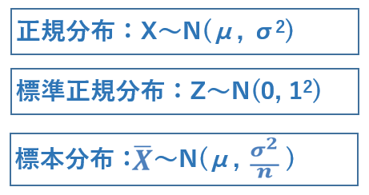
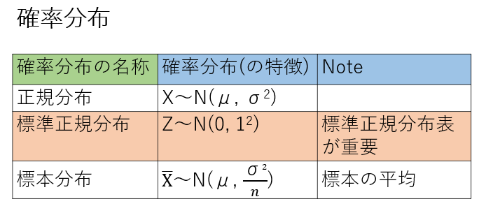

# 2022.06.27.DataScience_b
## なぜ我々は平均値を知りたいのか？
- 母集団の平均値を知りたい！
  - 本当に知りたいことは、母集団の情報！

- 母集団
  - Ex: 2016年の小学6年生 -(抽出)-> 標本
    - Ex: 東京都の2016年の小学6年生 -(推定)-> 母集団
    - (我々は通常、このデータしか扱えない)

全国の平均を取るのは現実的に難しい
よって、標本となる所から平均を取って母集団の平均値を推定する
※必ず母集団の平均値からは多少なりともずれてしまう

- 母集団
  - 全体・すべてのデータの平均値を求めたい
  - (しかし、全てのデータをもれなく集めることは不可能)
- 標本
  - 全体の内の部分的なデータ・サンプリング(採取)

この標本データを使って、母集団の平均値を予測したい
(この標本の平均値の信頼性は？どのぐらい信頼性があるのか？)

## 確率分布の表記
μ(平均値)
σ(標準偏差)
σ²(分散)

標本分布Xバーは、正規分布(全体)のXからn個取ってきた平均値だということ。
Nの平均値は同じ、分散が違う。

