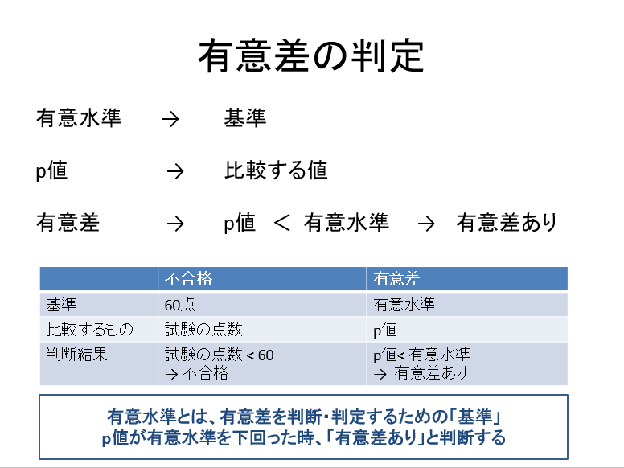
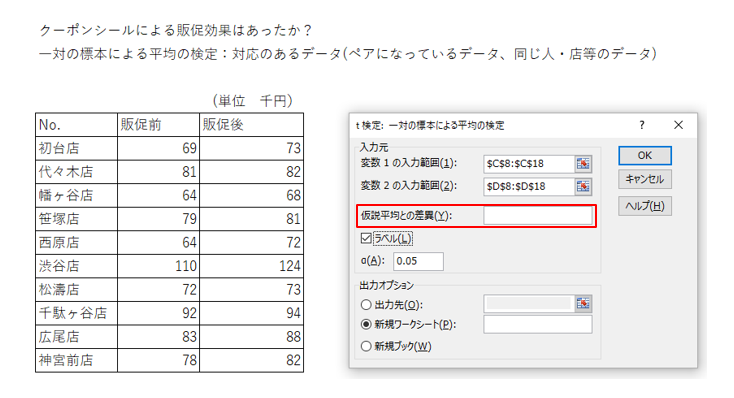

# 2022.08.29.DataScience_B
# t検定
**2つのグループの平均の差が、意味のある差か？**

## t検定とは？
**2群の平均値に有意な差があるかの検定**

- より分かりやすく
2グループに分かれていて集計してみた結果、2つの平均値に差があった
**この差は偶然の範囲・誤差の範囲なのか？**
**それとも十分に意味のある差なのか？**
それを統計学的にハッキリさせるのが「t検定」である！

## 有意差の判定

## 統計学(t検定)の用語に慣れる

## 帰無仮説
H0: μ1 = μ2 と仮説してスタートする

仮説平均との差異を空欄に指定することでμ1 = μ2としている。

