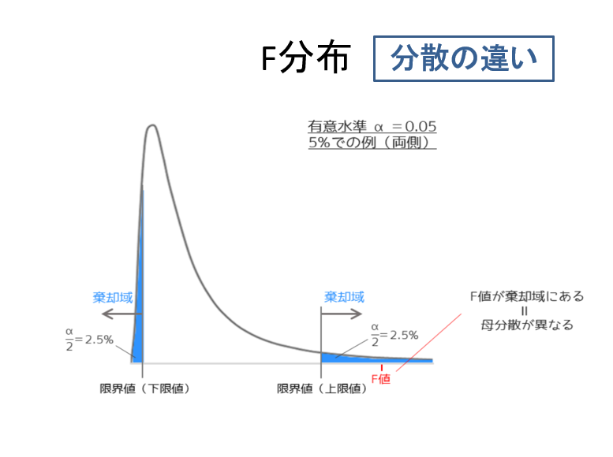
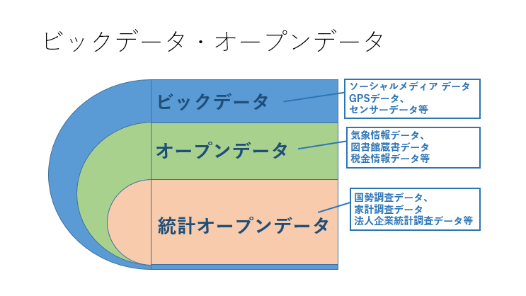

# 2022.09.05.DataScience_b
# t検定
## 3つのt検定
1. 1対の標本による平均の検定
2. 等分散を仮定した2標本による検定
   1. F検定(>0.05): 等分散
3. 分散が等しくないと仮定した2標本による検定
   1. F検定(<=0.05): 分散が等しくない

0.05より小さい -> 有意差あり
0.05より大きい -> 有意差なし(偶然)

## 逆を仮定
帰無仮説 -> 対立仮設

## 両側検定
2つのデータに差があるかどうかを見たい(検定したい) -> 両側検定

`=F.TEST()`で出るのは青い両方の値(合計値)が出る
F検定で出る値は右側の青い部分`α/2`しか出ない点が注意！

# ビッグデータ
- ビッグデータの3V
  - Volume
    - データ量
  - Velocity
    - 速度
  - Variety
    - 多様性

## データを取ってくる
1. 気象庁にアクセスする
2. 各種データ・資料
3. 気象 -> 気象観測データ -> 過去の地点気象データ・ダウンロード
4. 地点を選ぶ
   1. 埼玉・熊谷
5. 項目を選ぶ
   1. 日平均気温
6. 期間を選ぶ
   1. 特定期間
   2. 7/1 ~ 8/31, 2012 ~ 2021(直近10年間分)
7. CSVファイルをダウンロード
8. Excelファイルとして保存しなおす
9. 違う期間を選ぶ
   1. 同上条件, 1912 ~ 1921
10. 再度Excelファイルとして保存する
11. 最近と昔を統合し、比較ファイルとする
