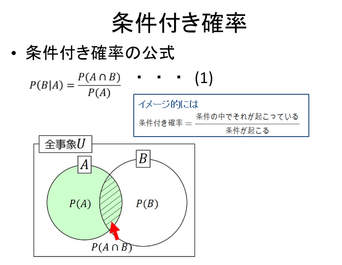
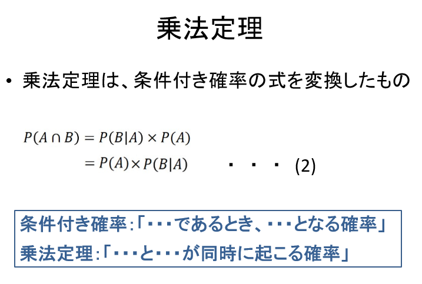

# 2022.09.12.DataScience_b
# ベイズの定理
## 乗法定理

∩ -> キャップ、(かつ、交わりと読まれる)
| -> given, =when
P(A∩B) -> 論理和と同じ、or

n(A∩B) / n(A)
= (n(A∩B) / n(U)) / (n(A) / n(U))

- 乗法定理は、条件付き確率の式を変換したもの

P(A∩B) = P(B|A)*P(A) ->
P(A)*P(A∩B) = P(B|A) ->
P(B|A) = P(A)*P(A∩B)

