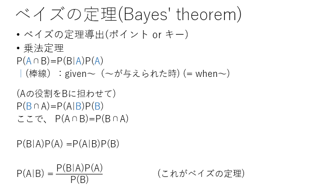

# 2022.09.12.DataScience_b
# ベイズの定理
## 乗法定理

**∩ -> キャップ、(かつ、交わりと読まれる)**
**∩ == *(掛け算と思って良い)**
(U: ユニオン) == +(足し算と思って良い: 今回は使わない)

**| -> given, =when**
P(A|B) -> 何を意味しているかと言うと、**事象Aが起こったときの事象Bが起こる条件付き確率を求める**という意味

P(A∩B) -> 論理和と同じ、or

n(A∩B) / n(A)
= (n(A∩B) / n(U)) / (n(A) / n(U))

- 乗法定理は、条件付き確率の式を変換したもの

P(A∩B) = P(B|A) * P(A) ->
P(A) * P(A∩B) = P(B|A) ->
P(B|A) = P(A) * P(A∩B)

1. P(A∩B) = P(B|A) * P(A)
2. P(A∩B) = P(A) * P(B|A)
求めるものに応じて、上の2つの式を使い分ける。

#### 練習問題
100本の中に10本の当たりがあるくじを、A君、B君の順に1本ずつ引く。引いたくじは元に戻さないとき、次の確率を求めよ.

(1)A君が当たりくじを引く確率 -> P(A)とする
(2)A君が当たりくじを引いたとき、B君が当たりくじを引く確率

1. P(A)10/100 -> 0.1(10%)
2. P(B|A) = P(A∩B) / P(A)の式を使う
求める確率 = (A君が当たりくじを引き、B君も当たりくじを引く確率) / (A君が当たりくじを引く確率)
また、
条件1. A君、B君の順に1本ずつ引く
条件2. 引いたくじは元に戻さない

A君が引く確率 10/100
その次にB君が引く確率 9(残り当たりくじ数)/99(残りくじ総数)
= 10/100 * 9/99 / 10/100 -> ~~10/100~~ * 9/99 / ~~10/100~~
9/99 -> 1/11

## ベイズの定理

- 乗法定理
P(A∩B)=P(B|A)P(A)
※P(A∩B) == P(B∩A)
A -> B, B -> Aに変更する
P(B∩A)=P(A|B)P(B) -> 左辺と右辺を入れ替える。
P(A|B)P(B)=P(B∩A) -> 右辺はP(A∩B)=**P(B|A)P(A)**を使う
P(A|B)P(B) = P(B|A)P(A) -> 左辺のP(B)を右辺に持ってくる
P(A|B) = P(B|A)P(A) / P(B) "**これがベイズの定理**"

- `P(A|B) =`が言いたいこと
ベイズの定理は**事象Aが起こったときの事象Bが起こる条件付き確率を求める公式**と言える。
`P(A|B)` == `P of A given B`
