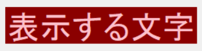

# 2022.06.24.GameProgramming_b
## tkinter
tkinter(ティーケーインター/ティーケンター)とは、Python
でGUI(グラフィカル・ユーザ・インターフェース)を構築する
ために用意されている「標準ライブラリ」です。

標準ライブラリなためインストールの必要が無く、Pythonが
インストールされていれば利用できます。

- tkinterモジュールのインポート
import tkinter
- ウィンドウオブジェクトを作る
root = tkinter.Tk()
- ウィンドウオブジェクトの表示
root.mainloop()

ファイルを実行するとウィンドウオブジェクトが出てくる

- mainloop()
  - この関数です。mainloop()という関数でウィンドウを表示し、その中で処理がずっとループし続けているためクリックなどに反応してくれるのです。

### label
変数 = tkinter.Label()
my_label = tkinter.Label(
  root, text="表示する文字",
  font=("System", 36)
  )
my_label.place(x=100, y=200)

---

- font
  - font("フォントの字体", フォントサイズ)
  - font=("System", 36)

- text
  - text="表示する文字"

変数名.place(xとyの指定)
my_label.place(x=100, y=200)
※起点は左上

- ラベルウィンドウの指定
  - width, heightは何文字分表示するか、を指定する
  - フォントサイズによって幅は調整される

- カラー
Label()のキーワード引数に「fg」と「bg」を追加してみます。
「fg」は「foreground(前景)」という意味で、ラベルの場合文
字の色を指定できます。「bg」は「background(背景)」という
意味で、ラベルの場合、背景色を指定できます。

fg = "pink", bg = "darkred"
(文字色がピンク、文字の背景がダークレッド)

## 改行
total = 1 + 2 + 3 + 4 + 5 \
+ 6 + 7 + 8 + 9 + 10

このようにバックスラッシュを記述すると改行して続けることができる。
※リストや()内はバックスラッシュを省略することができる。

()のインデントをずらす場合直前に\が必要
例) okパターン
title(

)

NGパターン
title
(

)
NGをOKにするために
title\
(

)
