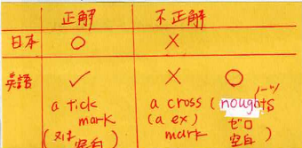
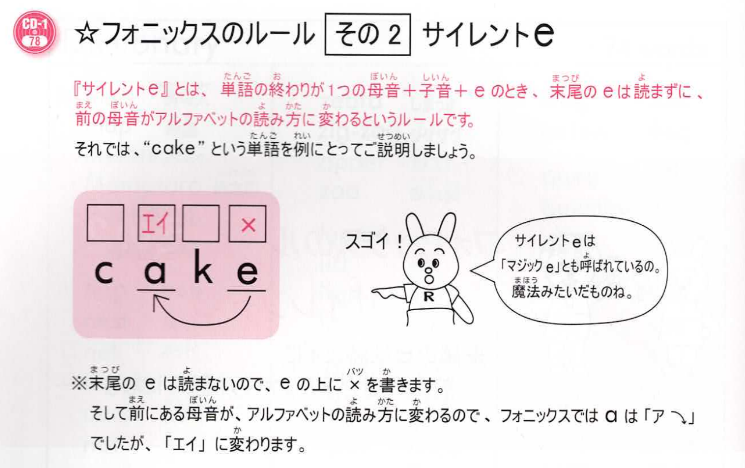
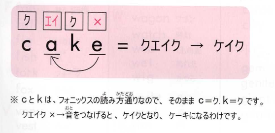

# 2022.06.29.InformationEnglish_b
- And you name is?
  - what is your nameは失礼な時がある

- 質問、疑問は語尾を上げると伝わる

- give 人 物
  - 人に物をあげる
  - give + 人 + 物 で覚える！

- email 人 物
  - 人に物をemailで送る

- 国名 + food
  - 国名の先頭は大文字
  - Italian food, Japanese food

△は日本のみ

- We both like ~
  - We like でも伝わるけど、協調したい

- Yes, Noの使い方
  - 日本人は質問によって答え方を変える
  - 欧米の場合は、常に自分の主張をする

## haveの使い方
日本人は「モノ」が持っているという使い方が苦手
欧米人は「モノ」が主語を良く使う

## フォニックスのルール サイレントe

