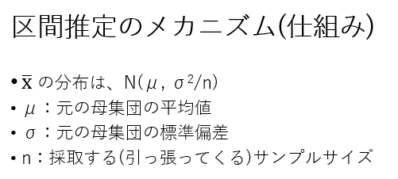
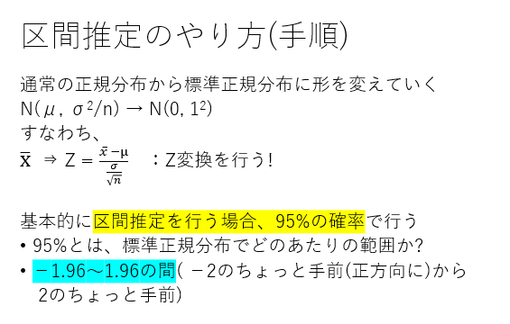

# 2022.06.27.DataScience_b
## なぜ我々は平均値を知りたいのか？
- 母集団の平均値を知りたい！
  - 本当に知りたいことは、母集団の情報！

- 母集団
  - Ex: 2016年の小学6年生 -(抽出)-> 標本
    - Ex: 東京都の2016年の小学6年生 -(推定)-> 母集団
    - (我々は通常、このデータしか扱えない)

全国の平均を取るのは現実的に難しい
よって、標本となる所から平均を取って母集団の平均値を推定する
※必ず母集団の平均値からは多少なりともずれてしまう

- 母集団
  - 全体・すべてのデータの平均値を求めたい
  - (しかし、全てのデータをもれなく集めることは不可能)
- 標本
  - 全体の内の部分的なデータ・サンプリング(採取)

この標本データを使って、母集団の平均値を予測したい
(この標本の平均値の信頼性は？どのぐらい信頼性があるのか？)

## 確率分布の表記
μ(平均値)
σ(標準偏差)
σ²(分散)

標本分布Xバーは、正規分布(全体)のXからn個取ってきた平均値だということ。
Nの平均値は同じ、分散が違う。

### 問1: Z=0からZ=1.95の確率は？
標準正規分布表を用いて答える。

※Zが出たら標準正規分布！ -> 標準正規分布表を使う！
下一桁までが縦軸の参照, 下二桁は横軸の参照

0.4744

### 問2: Z=0 ~ Z=1.97の確率は？
0.4756

### 問3: Z=0 ~ Z=1.96の確率は？
0.4750

### 問4: Z=-1.96 ~ Z=0の確率は？
上と同じ

### 問5: Z=-1.96 ~ Z=1.96の確率は？
0.4750 * 2 = 0.9500

Xバーは標本分布。

-1を各辺に掛けた場合、不等号も逆になる。

### 練習問題_区間推定
１学年１０００人の学校で、１００点満点の共通テストを行い母集団の標準偏差は５でした。この学年より無作為に選ばれた１０人の点数は次の通りです。
７０、５０、３０、７５、４０、６０、９０、３５、４０、８０
このとき、母平均の信頼度95%の信頼区間は？

1. 標本平均を出す
   1. (70+50+30+75+40+60+90+35+40+80)/10 = 57
2. 平均57, 標準偏差5, 採取人数10(人)
3. 式に当てはめる
   1. 57 - 1.96 * (5 / √10) ≦ 母平均 ≦ 57 + 19.6 * (5 / √10)
   2. 57 - 1.96(√(5² / 10)) ≦ 母平均 ≦ 57 + 19.6√(5² / 10)
   3. 57-3.1≦母平均≦57+3.1
   4. 53.9 ≦ 母平均 ≦ 60.1

## Excelの√の書き方
√10 -> (10)^(1/2)

=C7-(1.96*C8/(C9)^(1/2)) ≦ μ ≦ =C7+(1.96*C8/(C9)^(1/2))

## n(採取人数)
採取人数を増やすと母平均の信頼区間の幅が狭くなる。
