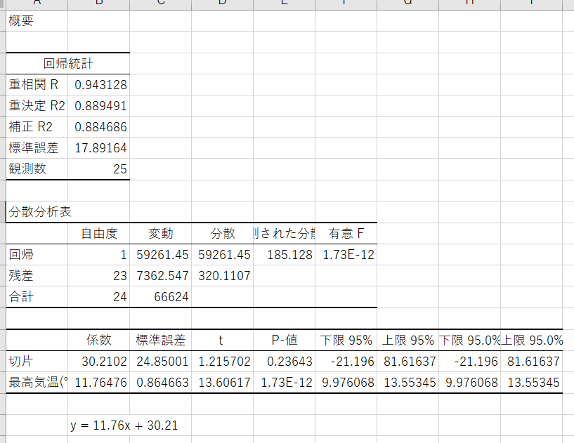

# 2022.07.04.DataScience_b
# 単回帰分析
- 単回帰分析
  - 2つのデータ群を「原因」と「結果」の関係で捉えたとき、それらの関係を回帰直線(y=ax+b)で表すことのできる分析手法
  - 2種類のデータの関係性を調べる
    - 散布図作成
    - 単回帰式を求める(1. 散布図の点->近似曲線の追加機能 使用、2. 分析ツール 使用)
    - アイスコーヒー注文数予測(1. 単回帰式使用 2. 関数使用)

- 説明変数
  - 原因となる変数
- 目的変数
  - 結果となる変数

y = ax + b
y -> 目的変数(答え)
x -> 説明変数(データ)

## AIとは？
入力: データ + 答え(ラベル) -> PC -> 出力: ルール

今日で言うと、
ルール -> y = ax + b (a, b -> パラメータ)
予測に使用できる

## Excelにデータ分析を導入
1. ファイル -> オプション
2. アドイン
3. 設定
4. データ分析にチェック
5. OK

## 統計で大事なこと
- t検定とは
  - 2群の平均値のデータを比較し、その違いの原因を求める

- 重決定:
  - 下に出ている係数(a, b)は、89%の精度あり！
  - -> 出た予測の数値は89％の精度があると見て良い

## 重回帰
y = a1x1 + a2x2 + ... +anxn + b

