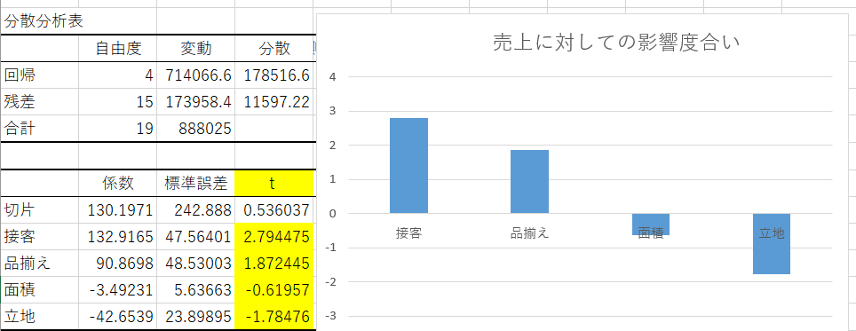
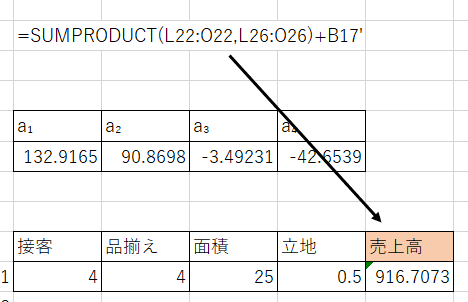

# 2022.07.11.DataScience_b
# 2変数以上: データの関連性を探る ~重回帰分析(多変量解析) ~
- 重回帰分析
  - あるデータ(目的変数: y)に影響を与えていると考えられる要因(説明変数)が複数ある回帰分析を重回帰分析と言う

## 重決定 R2, t値の理解・把握
- 重決定R2
  - 回帰式全体の精度を表す
- t値
  - **説明変数の目的関数(y)に対する影響の大きさ**

重回帰分析のポイント：要因分析と予測分析
コンビ二チェーンの売上高に影響している要因を、データ名:要因調査 を使用して、Excel 回帰分析を使い、
重決定 R2及びt値を算出する「要因分析」手法を理解する(参照: 重回帰分析PP)

説明変数が4つの重回帰式
重回帰式: y=a1x1+a2x2+a3x3+a4x4 + b
ai: 回帰係数
b: 切片

数値が－(マイナス)の場合でも、絶対値の数値で考える。

実在するデータと、既存のデータから採った係数、+b(切片)で売上を予測する。

## 重決定R2ではなく、補正R2を使う理由
重決定R2は変数が増えれば増えるほど上がっていくため、補正R2を使用する
