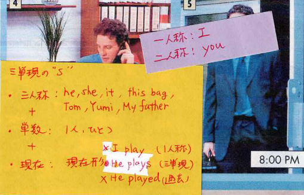
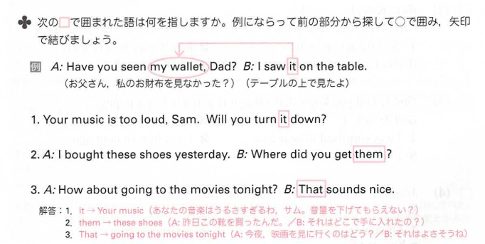
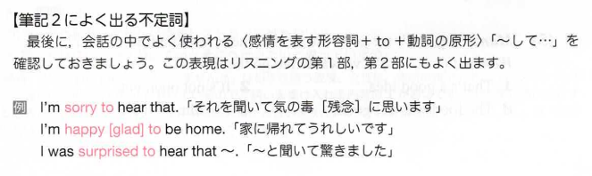

# 2022.07.13.InformationEnglishBasic_b
## 時間
- ちょうどのとき
  - 2:00, 3:00
  - two + o'clock
  - (時) + o'clock

英語圏では12時間制(全てではない)

- .
  - Doctor → Dr. のように略す時にも使われる
  - a.m. p.m.
  - 2:00 p.m.(後付け)

- 6:05
  - six oh(0) five と言うことも多い
  - ゼロをオーと読む

- 午前0時(夜中)
  - 12:00 a.m.
  - 英語に0時はない
  - midnight
  - twelve o'clock at night

- 午後0時(昼間)
  - 12:00 p.m.
  - noon
  - midday
  - twelve noon (in the day)

- 3 a.m.
  - It's three o'clock in the morning.
- 3 p.m.
  - ~ in the afternoon.
    - (12:00 ~ 16:00 前後)
- in the evening.
  - 6:00 p.m. ~ 11:59

- weekdays
  - 平日の月~金
  - weekday
    - 平日のどこか1日を指す

- have breakfast
  - 朝食を食べる
  - eatはあまり使わない

- get home
  - 家に着く
  - go home
    - 歩いて家に行くイメージ

- maybe
  - 50:50
  - 確率としては低め

- 確率
  - always
    - 100%
  - usually
    - ~80%
  - often
    - ~70%
  - sometimes
    - ~50%(時々)
  - seldom, hardly
    - ~10%(ほとんどない)
  - never
    - ~0%
      - 決して～ない

## 英検3級
- matter
  - 問題

- Ms.Baker
  - 先生に対して付ける
  - 英語圏はあまり～先生と呼ばない
    - may I
      - 敬って言ってるので相手が先生だと分かる

- Certainly
  - すごい肯定

## get
- 手に入れる
- 状態を手に入れる
  - (相手を)その状態にさせる

上にある大枠を前提として、getの多様な意味を理解する

- get rid of
  - ~を取り除く

## 同じ単語を繰り返さない
前の文章、会話で出てきた単語、人などはit, heなどに置換えられる。
英語圏では同じ単語の繰り返しを嫌う

it, themなどを読み飛ばさず、どこの事を指しているのか確認する癖を付けると良い。

