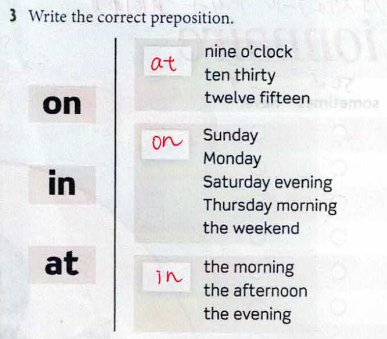

# 2022.07.20.InformationEnglishBasic_b
- questionnaire
  - クエスチョナール
  - アンケート・質問事項

- What day is today?
  - 曜日を聞かれている
    - Monday
    - Tuesday
    - Wednesday
    - Thursday
    - Friday
    - Saturday
    - Sunday

- what's wrong?
  - 調子悪そうな人に聞く
  - 調子良さそうな人には聞かない(使わない)

- 主語 + 動詞 + that
  - ~すること

- I've had enough
  - おなかいっぱいの状態
  - さっき食べたから

- Why don't we ~
  - 強めのお誘い

- May I speak ~
  - ~とお話できますか？

- speaking
  - 私です
  - 私が話しています

- stranger
  - よそから来た人

## 言語の違い
英語は後から補足するため、先から訳した方がやりやすい

- threw(throw) away
  - 捨てる
  - 放り投げる

# IT英語
- budget
  - 予算

- outage
  - 停止

- data
  - 単数形 -> datum
  - dataは(一応)複数形

