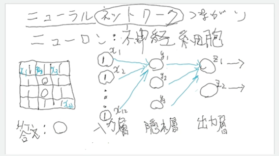
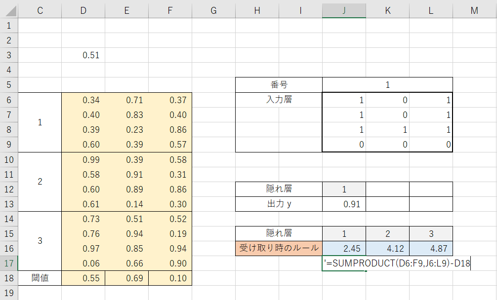
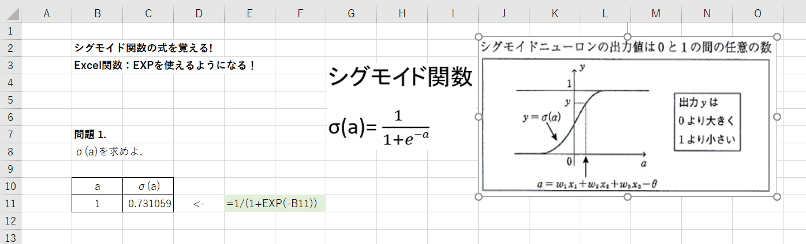

# 2022.09.26. AI Basics

## AI -ニューラルネットワーク-

* ニューロン
  + 神経細胞
* ネットワーク
  + 繋がり

x1, x2 ... x12 -> 入力層(最初の層)
y1, y2, y3 -> 隠れ層(中間層)
z1, z2 -> 出力層(出力層)

* xからyに、**受け取る時のルール**
* yからzに、**出す時のルール**

## Excel

* 受け取る時のルールの出し方 -> **入力の線形和**

* シグモイド関数(Sigmoid)
e: **ネイピア数**

## 微分

* 微分
  + 曲線の"傾き"
  + 変数が1個

`y = f(x)` -> 変数(x)が1個
関数 `y` の微分:
 `y' = f'(x)`

`= dy / dx` -> **yを変数xで微分**

<!-- インライン表示 -->
$f'(x) = ax^n$
$f'(x) = n*ax^{n-1}$ // 変形後

問1: $f'(x) = 2x^3$
$= 3*2x^2$
$= 6x^2$

$\displaystyle\frac{dy}{dx} = 6x^2$

問2: $y = 5x^5$
$= 5*5x^4$

$\displaystyle\frac{dy}{dx} = 25x^4$
