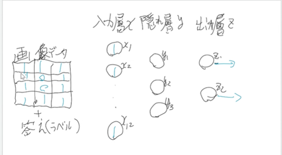

# 2022.10.24. AI Basics

# ニューラルネットワーク

* 出力層
  + z1 -> ◯担当(×の事は気にしない)
  + z2 -> ×担当(◯の事は気にしない)

* 隠れ層
  + y1, y2, y3はそれぞれ、x1~x12までのある部分しか興味を持たない！(y1, y2, y3の興味のある部分は違う)

ルール = 重みと閾値

x -> y -> z (順伝搬)

x <- y <- z (誤差逆伝搬, 勾配降下法)
