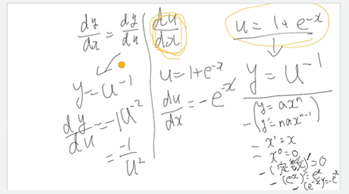
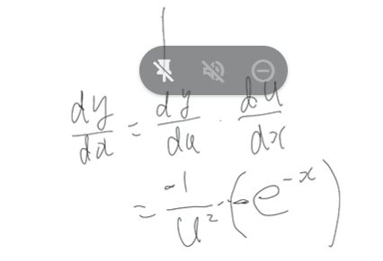
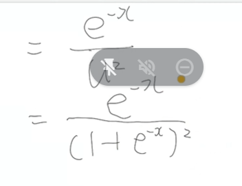

# 2022.11.14

$y = \frac{1}{1+e^{-x}}$
$y = (1 + e^{-x})^{-1}$

$u = 1 + e^{-x}$ と置く。
$y = u^{-1}$ となる

$\frac{dy}{dx} = \frac{dy}{du}\frac{dy}{dx}$

1. $\frac{dy}{dx} = \frac{dy}{du}$
$y = u^{-1}$を当てはめる
$\frac{dy}{dx} = -1u^{-2}$

- 偏微分
  - 2変数以上の関係の微分

$f(x, y) = 2x^2 + 6y^3 + 2$

上記関数f(x, y)を変数xで微分してください。
