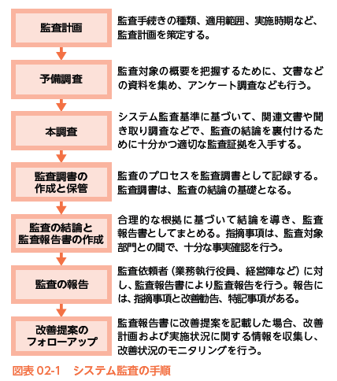

- [2022.09.20.ComputerScience](#20220920computerscience)
- [システム監査と内部統制](#システム監査と内部統制)
  - [システム監査の役割と目的](#システム監査の役割と目的)
    - [システム監査人の要件](#システム監査人の要件)
    - [システム監査基準](#システム監査基準)
    - [システム監査の手順](#システム監査の手順)
  - [情報システムに関するそのほかの監査](#情報システムに関するそのほかの監査)
    - [監査の種類](#監査の種類)
  - [内部統制](#内部統制)
    - [重要項目](#重要項目)
    - [ITガバナンス(IT governance)](#itガバナンスit-governance)
    - [法令順守状況の評価・改善](#法令順守状況の評価改善)
# 2022.09.20.ComputerScience
# システム監査と内部統制
## システム監査の役割と目的
情報システムに関するリスクを**第3者**から見る事で、早期に問題を発見して改善につなげること。
第3者 -> 独立かつ専門的な立場のシステム監査人

- **システム監査基準**

システム監査は、点検・評価・検証した内容を、利害関係者に説明(**監査証拠**)する責任がある。

- システム情報のリスク
システムに対する脅威(操作ミス、不正アクセス、自然災害など)が、情報資産の脆弱性に付け込んで、**情報資産に損失または損害を与える可能性**のこと

- 監査証拠
システム監査報告書に記載する**監査意見を立証するために必要な事実**
物理的証拠、文書的証拠、文書化された口頭的証拠などがある。
それらは**監査調書**にまとめる。

### システム監査人の要件
監査対象となるシステムとは利害関係があってはならない。**独立性**(監査対象のシステムと関係のない人)のある人が適任。
逆に、監査対象の開発や運用に携わっている人は、**独立性**を持たないので不適任。

監査人は**守秘義務**を負っており、監査を**監査証拠**に基づいて、公正かつ客観的に監査判断を行わなければならない。

監査人は、ただ監査をし、監査報告書を作成するだけ。(指摘、改善提案などは行う)
指摘事項などの改善は監査依頼人側で行う。

### システム監査基準
システム監査の手順や内容を規定したもの

### システム監査の手順

## 情報システムに関するそのほかの監査
### 監査の種類
監査の対象によって、以下のような種類がある
1. 会計監査
2. システム監査
3. 情報セキュリティ監査
4. 個人情報保護監査

## 内部統制
- 内部統制とは？
健全で効率的な組織運営のための体制を、企業自ら構築して運用する仕組みのこと
例: 企業内部で、不正や違法行為などが行われていないか管理するなど

### 重要項目
- 業務プロセスの明確化(可視化)
  - 業務の流れを可視化する。リスク分析や、業務改善に役立てることができる
- 職務分掌の見直し
  - 1つの部門や社員が、ある業務の全プロセスを行うことがないように、見直しをする
- 実施ルールの制定
  - 業務プロセスごとに実施ルールを決める
- チェック体制の確立
  - 定期的に監査を行い、モニタリングしていく
- **ITガバナンス**の確立
  - 情報システム戦略を策定
    - 策定した戦略を実行する

### ITガバナンス(IT governance)
ガバナンス -> 統治、管理などの意味があり、「よりよい方向へ導くための仕組み」と考えて良い
ITガバナンス -> 企業などが競争力を高めるために、戦略実行を統制する仕組みを確立するための取り組みのこと

### 法令順守状況の評価・改善
**コンプライアンス**
法律や規則などの基本的なルールに従って行動すること。
企業は適切なタイミングと方法で法令等の遵守状況を評価し、従業員の教育指導なども含め、常に監視し改善する必要がある。

