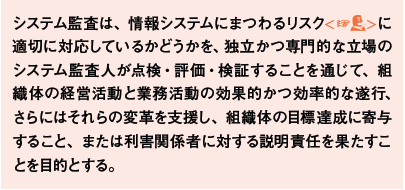

- [2022.09.20.ComputerScience](#20220920computerscience)
- [システム監査と内部統制](#システム監査と内部統制)
  - [システム監査の役割と目的](#システム監査の役割と目的)
    - [システム監査人の要件](#システム監査人の要件)
# 2022.09.20.ComputerScience
# システム監査と内部統制
## システム監査の役割と目的
情報システムに関するリスクを**第3者**から見る事で、早期に問題を発見して改善につなげること。
第3者 -> 独立かつ専門的な立場のシステム監査人

- **システム監査基準**

システム監査は、点検・評価・検証した内容を、利害関係者に説明(**監査証拠**)する責任がある。

- システム情報のリスク
システムに対する脅威(操作ミス、不正アクセス、自然災害など)が、情報資産の脆弱性に付け込んで、**情報資産に損失または損害を与える可能性**のこと

- 監査証拠
システム監査報告書に記載する**監査意見を立証するために必要な事実**
物理的証拠、文書的証拠、文書化された口頭的証拠などがある。
それらは**監査調書**にまとめる。

### システム監査人の要件
監査対象となるシステムとは利害関係があってはならない。
監査人は**守秘義務**を負っており、**監査証拠**に基づいて、公正かつ客観的に監査判断を行わなければならない。
