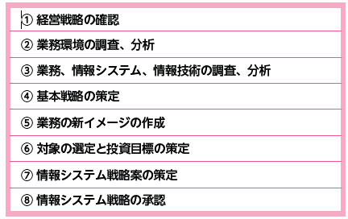

# 2022.09.27.ComputerScience

# 情報システム戦略と業務プロセス
## 業務モデルから立てる情報システム戦略
- 情報システム戦略
経営資源を最大限有効に活用するための**システム構築を目的**とし、業務においてどのように情報技術を活用していくかを示す**計画**

- 情報システム戦略の策定手順
現在の業務の流れを客観的に分析し、理想とすべき新しい業務モデルを策定するまでの手順

情報システム戦略を構築していく際に、具体的な手本となるのが**システム管理基準**。

## 
