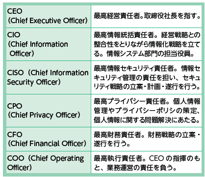
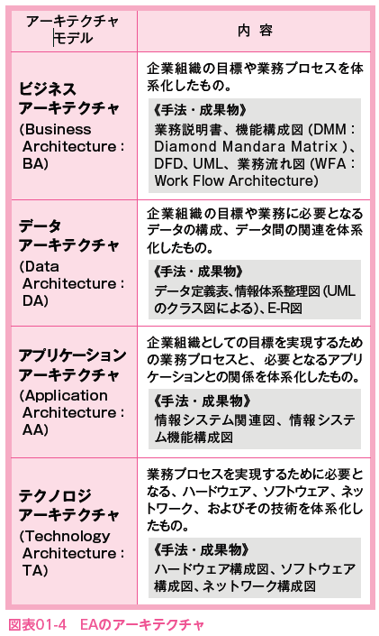
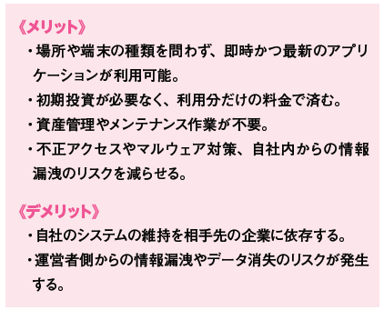
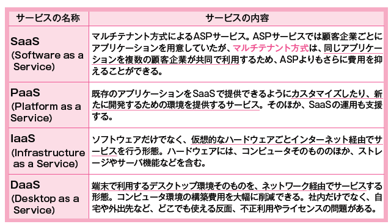

# 2022.09.27.ComputerScience

# 情報システム戦略と業務プロセス

## 業務モデルから立てる情報システム戦略

- 情報システム戦略
経営資源を最大限有効に活用するための**システム構築を目的**とし、業務においてどのように情報技術を活用していくかを示す**計画**

- 情報システム戦略の策定手順
現在の業務の流れを客観的に分析し、理想とすべき新しい業務モデルを策定するまでの手順

情報システム戦略を構築していく際に、具体的な手本となるのが**システム管理基準**。

## 情報システムの前提となるITガバナンス

- ITガバナンス
  - 経営陣がステークホルダ(利害関係を持つ全ての人たち)のニーズに基づいて、企業価値を高めるために実践する行動
  - または、情報システムをあるべき姿へ導くための、情報システムを実現するために必要な組織能力を指す

- ITガバナンスを実践するうえで留意すべき資源配分(以下具体例)

1. 情報システムから得られる効果の実現
2. 関連するリスク
3. 予算や人材

- ITガバナンスとしての組織体制
  - **情報システム部門、システム利用部門**
    - 経営陣とITマネジメントを行う
  - **委員会(情報システム戦略委員会、設置しない場合は経営陣)**
    - 理解関係者との調整役

- **EDMモデル**とは
  - ITガバナンスにおける規格
  - Evaluate(評価), Direct(指示), Monitor(モニタ)
  - ITマネジメントとそのプロセスに対し、経営陣が実践することを前提としている。

- システム管理基準におけるITガバナンスの10項目
1. 情報システム戦略の方針及び目標設定
2. 情報システム戦略遂行のための組織体制

3. 情報システム部門の役割と体制
4. 情報システム戦略の策定の評価・指示・モニタ
5. 情報システム投資の評価・指示・モニタ
6. 情報システムの資源管理の評価・指示・モニタ
7. コンプライアンスの評価・指示・モニタ
8. 情報セキュリティの評価・指示・モニタ
9. リスクマネジメントの評価・指示・モニタ
10. 事業継続管理の評価・指示・モニタ

## 目標となるモデルを作るEA
EA: Enterprise Architecture
企業の業務と情報システムを統一的な手法でモデル化し、業務とシステムの統合的な改善を目的とする管理手法のこと。

# ソリューションビジネスとシステム活用促進・評価

## ソリューションビジネス
**ソリューション**(solution): 問題解決のことを指す
主にITを活用して顧客企業の経営課題を解決することを**ソリューションビジネス**という。
それを行う事業者を**ソリューションプロバイダ**という。

- ソリューションビジネスには形態の違うによって以下の2つがある

1. **システムインテグレーション: SI**
業務処理に最適な商品を組み合わせて情報システムの企画・提案を行い、システム設計・開発・導入、運用、保守までの業務を一貫して請け負うサービス。
このような業務を行う者は、SI(システムインテグレータ)、またはSI事業者と呼ばれる。

2. **アウトソーシング**
業務委託
自社以外の企業に業務を委託すること。
例えば、情報システムの開発や運用などを外部の企業に委託する、などがある。

## ソリューションサービスの形態

#### 業務プロセスのアウトソーシング
業務のプロセスの一部を一括して外部に委託することを**BPO(Business Process Outsourcing)**と呼ぶ。
専門性に優れた外部企業をうまく活用する。

#### クラウドコンピューティング
インターネットを介してアプリケーションやハードウェアを利用できるサービス全般のこと。

- パブリッククラウド
契約者なら誰でも利用可能なクラウド環境の提供形態
安全性・コストが低い

- プライベートクラウド
特定の個人や組織専用のクラウド環境
カスタマイズ可能で安全性が高められる
コストは高くなる

- ハイブリッドクラウド
上記を組み合わせた携帯やクラウドと社内サーバなど、クラウド同士やクラウドと他と組み合わせるなどの利用方法

- オンプレミス
オンプレミスは"自社用"を意味し、自社運用とも呼ばれる。
クラウドの反対で、社内でサーバ環境を設置・運用することを指す。
セキュリティ管理を自ら行えるが、コストは高くなる。(運用コスト含む)

#### ソリューションサービス活用におけるメリット・デメリット

#### コンピュータ利用環境の提供
情報システムの機能や、アプリケーションソフトなどをインターネット経由で利用できるサービスを提供している事業者を**ASP(Application Service Provider)**と呼ぶ。
ASPが提供するサービスは**ASPサービス**と呼ぶ。

- メリット
  - アプリケーションを各PCにインストールしなくて良くなる
  - 運用管理が容易で、管理費用を削減することが可能

- ASPサービスの種類

