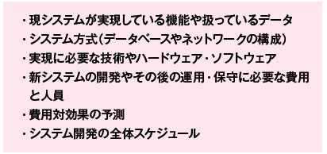
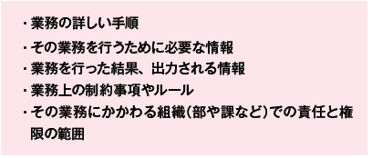
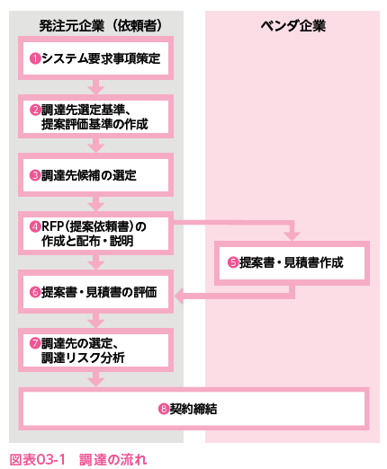

# 2022.10.04. ComputerScience

# システム企画

## システム化範囲を決めるシステム化計画

情報システム戦略に基づいて、**経営目標達成に必要なシステム化の範囲**、**システムの内容や構成など**を決定する。決定後、システム化へ向けた具体的な手続きを進めていく。
この一連の流れを**システム企画**と呼ぶ。

システム企画は、大きく分けて3つのフェーズがある。
* システム化計画
* 要件定義
* 調達計画および実施

### システム化計画

* システム化構想の立案
経営戦略や情報システムに沿って、以下の内容を検討し、文書化、承認を得る。
  + システム化の目的と期待される結果
  + システム化対象とする業務の明確化
  + 業務の全体像

* システム化計画の立案
以下の画像の観点で、システム化の範囲・開発スケジュール・開発プロジェクトの要因の体制などを検討する。

さらに、システムの有効性や投資効果を検証し、**システム化計画**として取りまとめ、経営陣の承認を得る。開発を外部に委託する場合、その作業項目やスケジュールなども計画する。

#### ITポートフォリオ

システム化計画の立案に際し、IT投資をどのようなバランスで行っていくかを分析すること

* 分析の観点
  + 投資対効果
  + 全体における資源の配分やバランスをみる
  + システムのライフサイクルを考慮しながら投資のタイミングを計る
分析には「**ポートフォリオ分析**」が利用される。

* ポートフォリオ分析
複数の要素を2つの評価項目で評価し、それぞれの要素が占めるポジションによってその特徴をつかむ手法。
最良の意思決定を行うため、収益性や成長性を分析し、効果のあがる投資の組み合わせや事業展開を検討する。

### 要件定義

**要求分析を行って現状とニーズを掴んだうえで**、要件定義を検討する

1. 要求分析
要求項目の洗い出し、分析を行い、システム化ニーズの整理をしていく。
さらに、前提条件や制約条件の整理、解決策の検討、実現可能性の分析、新しい業務モデルと業務フローの提案などを行う。

2. 要件定義
業務上実現すべき要件である**業務要件**を定義する。

更に業務要件を実現するために、必要な情報システムの機能を明らかにする**機能要件**、システムの性能や信頼性、移行要件など、機能以外の要件である**非機能要件**に分けて定義を行う。

### 調達計画・実施

* **調達**とは？
  + システムを購入したり、新たに作成(自社開発や外部企業への発注を問わず)すること

* **ベンダ・ITベンダ**とは？
  + 自社開発以外の調達先のこと
  + ソフトウェア開発企業や製品メーカー、販売者が販売代理店などを指す

#### 調達計画

要件定義書を踏まえ、以下の内容から調達方法を選択する。
* 製品やサービスの購入
* 内部や外部委託によるシステム開発など

以下を定義して、調達計画を策定する。
* 調達の対象
* 要求事項
* 条件など

#### 調達の実施(調達の依頼~契約締結)

* 調達の流れ

1. システム要求事項策定
開発するシステムに求められる要件をまとめる。
システムの範囲、必要な機能・性能など

2. 調達先選定基準、提案評価基準の作成
調達先の選定の際、考慮する項目と選定の基準をあらかじめ決める。
何を重視して発注先の選考を行うか？提案書を評価するか？
重視するものの例: 開発の確実性、信頼性、費用内訳、工程別のスケジュール、最終納期など

3. 調達先候補の選定
事前に、ベンダ企業に**RFI(Request For Information: 情報提供依頼書)**を配布する。
ベンダから提供された情報を元に候補企業を絞り込む。

4. REPの作成と配布・説明
**REP(Request For Proposal: 提案依頼書)**, **RFQ(Request For Quotation: 見積依頼書)**を作成する。
作成したREP, RFQを調達先候補となるベンダ企業に配布して説明を行う。

5. 提案書・見積書の作成
ベンダでは、RFPの情報をもとに、開発するシステムの構成や開発手法などを検討して、**提案書**を作成する。また、RFPに記載された作業の範囲に必要な費用を計算し、**見積書**を作成する。

6. 提案書・見積書の評価
* 提案書を分析する
* 見積書を分析する

7. 調達先の選定、調達リスク分析
提案書の評価を踏まえ、選定基準に基づいて、調達先のベンダを選定する。
調達リスク分析も行う。
-> 内部統制や法令遵守、**CSR調達**や**グリーン調達**などの観点からも検討を行う

* CSR(Corporative Social Responsibility) 調達
直訳すると、企業の社会的責任
調達時に取引先に対して、社員や労働条件に配慮しているか、環境への配慮を怠っていないかなどを考慮して調達基準を決めること。

* グリーン調達
調達に際して、相手先企業が環境への負荷に配慮した製品作りや部品調達を行っていることを考慮して、配慮している方を優先的に選定すること。

8. 契約締結
選定したベンダ企業と契約を交わす。
金額や作業内容・納期だけではなく、**守秘義務**や**完成したシステムの著作権**などについても契約に含める
