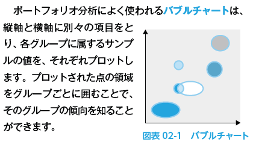
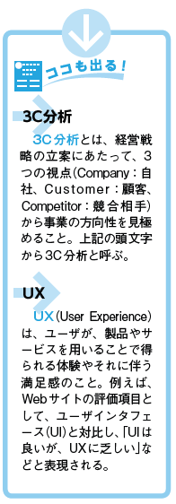

- [2022.10.11. ComputerScience](#20221011-computerscience)
- [経営戦略](#経営戦略)
  - [経営方針を定める経営戦略マネジメント](#経営方針を定める経営戦略マネジメント)
    - [他社の動向を知るための方法](#他社の動向を知るための方法)
    - [用語チェック](#用語チェック)
  - [様々な戦略手法](#様々な戦略手法)
    - [集中戦略とコアコンピタンス](#集中戦略とコアコンピタンス)
    - [コストリーダーシップ戦略](#コストリーダーシップ戦略)
    - [差別化戦略](#差別化戦略)
  - [ポジションで変わる競争戦略](#ポジションで変わる競争戦略)
    - [企業のポジション 4つのタイプ](#企業のポジション-4つのタイプ)
    - [強調戦略と合併・買収](#強調戦略と合併買収)
      - [用語チェック](#用語チェック-1)
- [経営分析の手法](#経営分析の手法)
  - [経営分析の手法](#経営分析の手法-1)
    - [ポートフォリオ分析](#ポートフォリオ分析)
- [マーケティング](#マーケティング)
  - [市場原理をつかむマーケティング理論](#市場原理をつかむマーケティング理論)
    - [用語チェック](#用語チェック-2)
  - [市場競争に勝つマーケティング戦略](#市場競争に勝つマーケティング戦略)
    - [製品戦略](#製品戦略)
    - [価格戦略](#価格戦略)
    - [流通戦略](#流通戦略)
    - [プロモーション戦略](#プロモーション戦略)
- [ビジネス戦略と技術開発戦略](#ビジネス戦略と技術開発戦略)
  - [経営戦略を具現化するビジネス戦略](#経営戦略を具現化するビジネス戦略)
    - [BSC(バランススコアカード)](#bscバランススコアカード)
    - [CSF(重要成功要因)](#csf重要成功要因)
  - [業務プロセスの改善と再構築](#業務プロセスの改善と再構築)
    - [QC](#qc)
    - [BRP](#brp)
  - [経営資源を活かす経営管理システム](#経営資源を活かす経営管理システム)
    - [経営管理の方法とそのシステム](#経営管理の方法とそのシステム)
# 2022.10.11. ComputerScience

# 経営戦略

## 経営方針を定める経営戦略マネジメント

* 経営戦略とは
  + 市場や同業他社の動向をリサーチし、経営の目標や方針を見極め、施策を実行していくこと。

目標を設定したら、**PDCAサイクル**: 「計画->実行->点検->処置」を繰り返しながら、戦略の実施結果や状況の変化を見極め、その後の施策に生かしていく。

### 他社の動向を知るための方法

1. ベンチマーキング
他社のプロセスを**ベンチマーク**(指標)として設定し、自社の業務プロセスと比較検討すること。
ベストプラクティスを見つけ出す参考とする。

2. ベストプラクティス分析
他社のやり方を徹底的に研究して、**ベストプラクティス**(自社に最適な実践方法)を見つけ出す方法。

### 用語チェック

* **多角化戦略**
現在主としている事業分野とは**別の分野を開拓または進出すること**。
目的は2点。
1. 現事業と何らかの関連性を持たせることで、進出のしやすさを狙う
2. 関連性はないが有望な分野を狙うことで、現状打破やノウハウの蓄積などを狙う

* **シナジー効果**
  + **相乗効果**のこと
**複数の事業を組み合わせたり**、**企業の統合や同業他社を取り込む**ことで、市場を専有したり、付加価値を生み出すこと

* **チェンジマネジメント**
市場や業務環境の変化に対応するため、**業務内容や社員の意識を変革する**取り組み。
変革の必要性に対する社員の理解が必要。

## 様々な戦略手法

* 「**競争優位性が高い**」とは
自社の製品の機能や価格で他社製品との差別化を図るなど、他社には真似できない経営戦略を実行し、**競合他社に対して優位にあること**を指す。

### 集中戦略とコアコンピタンス

* **集中戦略**
**特定範囲に経営資源を集中**させ、競争を優位に進める戦略のこと。
経営資源: 人的資源, 物的資源, 財務的資源

* **コアコンピタンス**
事業の中で**他社より優れた技術やノウハウを持つ分野**のこと。

* **コアコンピタンス経営**
**得意分野の事業に集中することで効率よく利益を上げる**という戦略

### コストリーダーシップ戦略

* コストリーダーシップ戦略
大きなシェアを持つ**優位性を生かして**コストダウンを図り、**他社よりさらに優位に立つ**戦略のこと。

### 差別化戦略

* 差別化戦略
**他社が成し得ない**ような特化した製品やサービスに注力することで、シェアを確保する戦略。

## ポジションで変わる競争戦略

**競争戦略**では、市場や競合他社の製品を分析し、その市場や業界の中で**自社がどのようなポジションにあるのか**を明らかにすることで、経営戦略を検討する。

### 企業のポジション 4つのタイプ

1. リーダ
最大シェアを持つ企業。
**常に他社をリードしていく戦略**を立てる。
新製品の投入, 製品ラインナップの拡充などで市場の維持と拡大、ブランド力の強化を図る。

2. チャレンジャ
シェアは2~3番手の企業。
**リーダの弱点や未開発の販売地域を狙うなど、挑戦的な戦略**が適する。
下位の企業の市場を奪ったり、他の企業を取り込むことで規模を拡大していく方法もある。

3. フォロワ
シェアが少ない企業。
**報復を招かないようにしてリーダに追随する戦略**を立てる。
徹底したコストダウン、低価格競争が可能な製品を投入する。

4. ニッチャ
小さな規模の市場を独占的に占める企業。
**競合を回避すべく、狭い領域で特化した製品を投入するニッチ(隙間)戦略**をとる。
高い利益を維持する。

### 強調戦略と合併・買収

* **アライアンス**
企業同士が共同で事業を行うこと。
提携手段: 販売、技術、生産、資本など
メリット: 短期間に大きな市場が取り込める
デメリット: 提携解消時にノウハウが流出するなどの代償が発生するリスクもある

* **M&A**(Mergers and Acquisitions)
アライアンスよりも強力な提携関係になるために行う、**企業の合併・買収のこと**。
例: 競合製品を持つ企業を買収して市場の優位性を高める。
例: まったく異なる分野の企業同士が合併して、新たな市場や製品の開発を目指す。

#### 用語チェック

* **ブルーオーシャン戦略**
**レッドオーシャン(競合他社がしのぎを削る分野)を避け**、未開拓分野に経営資源を投入する戦略。
発送の転換と、多方面からのニーズ分析が必要。

* **ファブレス**
自社では**生産設備を持たず、製品の設計開発や販売のみを行う企業の形態**。

* **EMS**(Electronics Manufacturing Service)
**他のメーカの委託を受け、指定された仕様・設計に基づいて製品を制作する受託生産**のこと。

# 経営分析の手法

## 経営分析の手法

経営戦略や事業戦略を立てる際には、**さまざまな観点からの分析を行う必要がある**。
代表的な分析手法は以下の通り。

### ポートフォリオ分析

* **ポートフォリオ分析**
複数の要素を2つの評価項目で評価し、それぞれの要素が占めるポジションによって、それらの特徴を掴む手法。

* **バブルチャート**

1. **事業ポートフォリオマネジメント**
**企業が行っている事業を**、ポートフォリオの手法によって分析し、**方向性を明らかにする**こと。
各事業の収益性や成長性を分析し、効果の上がる経営資源(資金や人材など)の配分や、今後の事業展開などを検討する。

2. **PPM(プロダクトポートフォリオマネジメント)**
**市場成長率**と**市場占有率**(マーケットシェア)の値の高低で、4つの領域に分けた図を用い、**製品の分析を行う手法**。

# マーケティング

## 市場原理をつかむマーケティング理論

* **マーケティング**
消費者が求めている製品や、ある製品の消費者への**受け入れ度合いを調べること**。

* **マーケティングリサーチ**
自社の製品や市場における現状を把握する。

### 用語チェック

## 市場競争に勝つマーケティング戦略

市場は常に動いているため、**常に流れをつかんでおく**ことが重要になる。
マーケティング戦略の種類は以下の通り。

### 製品戦略

マーケティング・リサーチに基づいて、自社の製品について検討を行い、**新商品や廃止商品、販売促進を行うべき商品を見極めること**。
製品戦略を立てる際には、**製品ライフサイクル(プロダクトライフサイクル)**の見極めが必要。

* 製品ライフサイクル
**製品を市場に投入してから、撤退するまでの一連の流れのこと**。

### 価格戦略

利益を確保しつつも、顧客が満足する価格を決めること(**プライシング**)

* プライシング方法

1. コストプラス法
製品の製造原価や営業経費などを、元のマージンに加えて価格を設定する方法

2. バリュープライシング
顧客が判断する価値によって価格設定を行う方法

### 流通戦略

生産者の商品を消費者に届けるための**マーケティングチャネル**(販売経路)を考えること。

### プロモーション戦略

消費者に商品を知ってもらうための活動のこと。

# ビジネス戦略と技術開発戦略

## 経営戦略を具現化するビジネス戦略

* **ビジネス戦略**
企業理念や企業のビジョンを踏まえながら、**経営戦略やマーケティングを具現化していく**こと。

### BSC(バランススコアカード)

* BSC
**企業戦略の目標値を定め、業績を評価するための一連の手法**
特徴: **財務**の視点, **顧客**の視点(市場占有率など), **業務**プロセスの視点, (従業員の)**学習と成長**の視点から、**戦略マップ**(戦略目標)を加えていく。

実際には、**CSF**によって施策の選択を行い、スコアカードを使って目標と評価指標、具体的なプランをまとめていく。

->
従業員1人1人にとって取り組みやすい、具体的な行動目標が可視化され、前者が一眼となって目標達成に取り組めるようになる。

立案した戦略プランの達成度合いは、**KGI**と**KPI(戦略目標の達成状況を示す指標)**を設定して検証する。**検証結果によって、BSCを更新する**。

* KGI(重要目標**達成Goal**指標)
達成すべき目標を示す指標。

* KPI(重要**業績評価Performance**指標)
目標に向けた中間地点での進捗度合いを図る指標

### CSF(重要成功要因)

* CSF(Critical Success Factors)
**競争優位を確立し、事業を成功させるために必須の重要な要因**

戦略目標達成のために、**重要度の高い施策から優先順位を付け**、必要な要因だけを選ぶ。
選んだ要因の施策に、**経営資源を集中して投入する**ことで、目標達成をより確かなものにする。

## 業務プロセスの改善と再構築

* 業務プロセス
段階的に進む業務作業の一連の流れのこと

業務プロセスを見直して最適化し、効果的なシステム活用を行う考え方として、**QC**と**BRP**がある。

### QC

* QC活動(品質管理)
業務単位での業務改善にはこの活動が行われる。
ただし、部分的な改善では改善できない場合には、業務全体を根本的に設計しなおす必要がある。

### BRP

部門間でのセクショナリズムを克服し、企業全体で仕事の手順をゼロから見直す活動。

## 経営資源を活かす経営管理システム

* 経営管理
**企業が持つ経営資源(人、モノ、金、情報)に加え、目標達成のためのさまざまな行動を管理すること**。

### 経営管理の方法とそのシステム

1. KM(ナレッジマネジメント)
ナレッジとは、知識のこと。
**企業内に散在する個々の知識を情報として共有し、経営に生かそうとする考え方**。

2. ERP(経営資源管理)
3. SFA(営業支援)
4. CRM(顧客関係管理)
5. SCM(供給連鎖管理)
