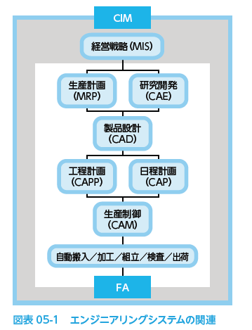
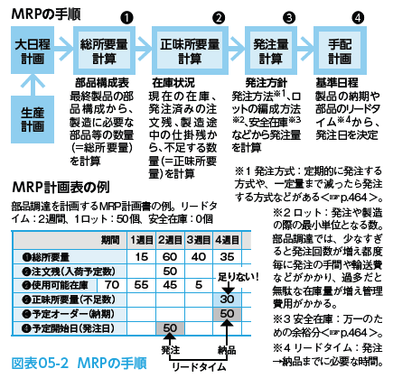

# 2022.10.18. Computer Science

# ビジネスシステムとエンジニアリングシステム

## 業務を支えるビジネスシステム

* ビジネスシステム
社内外で業務に使われているシステム全般のこと。

### 社内業務支援システム

社内業務をサポートするためのシステム。
業種に限らず必要な機能は共通するものが多いため、**パッケージソフト**の利用も可能。

* パッケージソフト
あらかじめ基本部分が用意された市販ソフトのこと。
自社の業務に合わせたカスタマイズを行ったうえで利用する。
  + 財務・会計システム
  + 人事・給与システム
  + 営業支援システム
  + など

* グループウェア
ネットワークを介して共同作業を総合的かつ円滑に行うソフトウェアを指す。
  + 電子メール / 電子掲示板
  + スケジュール管理
  + ドキュメントデータベース
  + など

### 基幹業務支援システム

企業活動の中心となる、メインの業務を支援するシステム。
業種や企業ごとに必要な機能は異なるが、共通部分はパッケージソフトの利用も可能。
* パッケージソフト
  + 生産業務(生産管理システム)
  + 物流業務(流通情報システム、物流情報システム)
  + など

* ERPパッケージ
企業の基幹業務を統合化したもののこと

* POSシステム
バーコードの読み取りによって販売された情報を即時に収集・処理するシステムのこと

### 行政システム、公共情報システム

企業や自治体によって運営される。
企業や個人が行政と関わる部分をサポートする公共の情報システム。

## エンジニアリングシステム

製品の設計や開発に使うためのシステムの総称。

### コンピュータ支援システム

* **CIM(コンピュータ総合生産)**
Computer Integrated Manufacturing

全ての生産管理情報をコンピュータで一括管理し、各高低で情報を共有することで、生産の効率化を図るシステムのこと。
経営戦略~開発~加工・組み立て、出荷に至るまで広く網羅している

* **MIS(経営情報システム)**
Management Information System

経営における意思決定の支援を行うシステムのこと。
さまざまな情報をデータベースで管理し、必要なデータを必要なときに提供することを目的としている。

* **CAE(コンピュータ支援エンジニアリング)**
Computer Aided Engineering

工業製品の設計段階で、コンピュータを活用して計画、設計、解析、施策などを行うこと。

* **CAD(コンピュータ支援設計)**
Computer Aided Design

コンピュータを使った設計のこと。
データベース化された設計情報を元に、対話的に設計を行うことができる。

* **CAM(コンピュータ支援生産)**
Computer Aided Manufacturing

機械加工をコンピュータによって自動化、無人化を可能にすること。
例: CAD(コンピュータ支援設計)で設計されたデータに基づき、**NC制御**(数値情報によって制御を行う)の工作機械に対する司令データを作成、組み立て・加工高低の自動制御を行う。

### 生産システム

* FA(ファクトリオートメーション)
Factory Automation

工場における生産工程の自動化を図るシステム。
オートメーション化により、多品種少量生産などのニーズへの対応が可能になる。

* CAP(コンピュータ支援計画)
Computer Aided Planning

生産計画に基づいて、作業の日程や機械の割当てなどを行う管理システムのこと。

* MRP(資材所要量計画)
Material Requirements Planning

生産計画を基に、生産管理を効率化する手法のこと。
必要な機材と期日、発注タイミングなどを的確に予測し、過剰在庫や資材不足で生産が滞るなどのトラブルを防止する。

## さまざまな生産方式

生産現場では、製品の生産工程や販売方式の特徴に合わせた生産方式が用いられる。

### ライン生産方式とセル生産方式

* ライン生産方式
作業者は特定の工程のみを担当する。
製品の完成までの工程を連続的に行う手法。

* セル生産方式
1人または少人数のグループで、1つの製品を最終工程まで作り上げる。
ライン生産方式と比べ、**多品種少量生産にもフレシキブルに対応できる**。

### ロット生産方式と個別生産方式

* ロット生産方式
同じ製品をまとめて大量につくる方式。

* 個別生産方式
顧客からの注文に応じて、仕様の異なる製品を個別につくる方式。

### JIT生産方式とかんばん方式

* JIT生産方式
Just In Time
「必要なものを必要なときに必要なだけ！」
資材をタイムリーに仕入れる事で、無駄な在庫を減らし、管理費の削減に繋げる手法

* かんばん方式
JIT方式を実現する方法の一つ。
どの部品をいくつ引き取ったかを**前工程側に伝えるため**、カードに記入する。このカードが「**かんばん**」と呼ばれていたのが言葉の由来。
**後工程側が、自工程の生産の進捗に合わせ、必要な数量のみ前工程へ取りに行く**方式。

# e-ビジネス

ネットワークを利用してビジネスを行うシステムを指す。

## ネット上で取引を行うEC

* **EC**(Electronic Commerce: **電子商取引**)
インターネット上で、商取引の一部または全部を行う取引形態のこと。

### 電子受発注システム(EOS)

* **EOS**(Electronic Ordering System: **電子受発注システム**)
伝票などで行っていた受発注を、データの受け渡しによって行う。

#### 電子調達システム

企業が資材や原材料などの調達を電子的に行うこと

#### 電子入札

電子調達に対して入札を行うこと。
※主に公共事業などの入札では、広告~通知~契約までの標準化が進んでおり、参加者はその仕組みを利用することで自由に参加できる。

#### オンラインショッピング

別名ネットショッピング。
Web上の仮想店舗から商品を購入するやりとり。

* バーチャルモール(オンラインモール)
多数のネットショップを集めたWebサイトのこと。

### 電子決済システム

インターネット上で、商取引の決済を行う仕組みのこと。

#### インターネットバンキング

ネットワークを通じて、銀行口座間の振込・残高照会・振替などを行う仕組みのこと

#### インターネットトレーディング

ネットワークを通じた証券取引の仕組みのこと
※インターネット上のやりとりの際にはSSLによる暗号化技術が活用される。

#### ICカード

無線チップ(ICチップ)を埋め込んだカード状のもの。
磁気カードに比べると偽造されにくいため、銀行のキャッシュカードなどに用いられる。

* RFID応用システム
非接触型で、読み取り機に通さなくても情報が読み取れる。
公共交通機関での運賃決済、携帯電話による決済にも採用されている。
