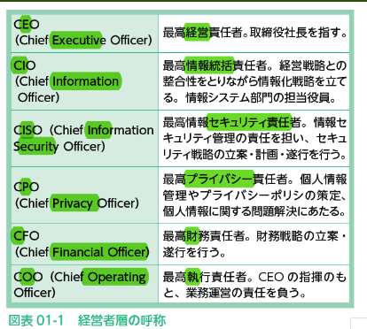

# 2022.10.25. ComputerScience

[業務分析・データ利活用　(全43問中5問目)](https://www.itpassportsiken.com/bunya.php?m=1&s=2&no=5)

[業務分析・データ利活用　(全43問中6問目)](https://www.itpassportsiken.com/bunya.php?m=1&s=2&no=6)

# 企業活動

## 経営・組織論

* 企業とは
保有している有効な資源をつかって、利益をあげる組織体のこと。
有効な資源: ヒト、モノ、カネ

* 株式会社
株主からあつめた資金をもとに企業活動を行い、得られた利益を株主に還元する仕組みのこと。

* ヒューマンリソースマネジメント
人的資源を有効につかうための管理や人材教育のこと。

* 裁量労働制
労働時間を実労働時間ではなく、裁量によってみなし時間できめる方式

* ワークシェアリング
労働者の勤務時間を短縮したり、複数の労働者で業務を分担するなど配分を見直して、より多くの雇用を確保する仕組みのこと。

* OJT(On The Job Training)
実際の業務を通じて、業務遂行に必要な技術を習得する研修制度のこと。

## 企業のトップが負うべき責任

* コンピテンシー
能力、または能力のある人材の行動特性のこと。
コンピテンシーを分析して、業務や人材教育に生かしたり、人事考課の基準に活用する。

* ダイバーシティ
多様な人材を採用し、多彩な能力を活用すること。

* BCP(事業継続計画)

* カンパニー制組織
社内分社制の1種。
