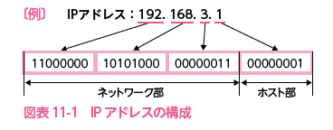

# 2022.11.29 Computer Science

## ネットワーク

### アクセス制御方式

* 共有する伝送路が長時間専有されるのを防ぐため(渋滞回避)
* データを小さい単位に分割して転送する
  + 単位をパケットやフレームという（レイヤによる）
  + 分割しても、毎回**アドレス番号**と**シーケンス番号**を転送する
    - アドレス番号：宛先や送信先
    - シーケンス番号：分割データの組み立てに必要な番号（ID）

### IPアドレスの役割

### シンクライアントシステム
